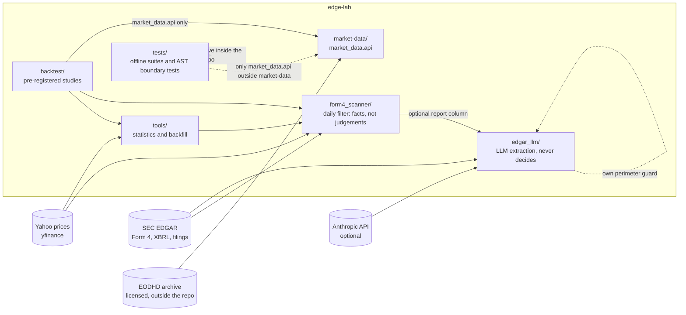

# edge-lab

A research lab for US market events built from SEC EDGAR data, with the method at the centre.

The stories that circulate about small caps are simple and testable: insiders know something, forced index selling
bounces back, IPOs that trade well keep winning. edge-lab takes such a story, writes down in advance what would count
as evidence for it, builds the data from primary sources, and publishes the verdict whatever it is. The studies in
this repository **did not find an edge**, and that is the point: each one shows where a number that looked like an
effect came from, and why it did not survive a fair comparison.

This is the public half of the project. The studies whose results held up, and the operational work built on them,
live in a private version of the repository.

What is here:

- **a Form 4 insider-purchase filter** (`form4_scanner/`) that keeps only genuine open-market purchases and hands a
  human booleans and the evidence behind them, never a recommendation;
- **the research infrastructure** around it: an EDGAR client with a disk cache, a point-in-time XBRL layer, a price
  archive client (`market-data/`), an LLM extraction package that enriches and never decides (`edgar_llm/`), and the
  statistics tools (`tools/`);
- **three published studies** (`backtest/`), each with its pre-registration, addenda, decision records, code,
  aggregate results and an English summary page;
- **the method**: how a study is pre-registered, and how coding agents were used and kept honest
  ([`docs/method/`](docs/method/)).

---

## Contents

- [Published studies](#published-studies)
- [Method](#method)
- [Architecture](#architecture)
- [The Form 4 filter](#the-form-4-filter)
- [Reproducing the tests](#reproducing-the-tests)
- [Repository layout](#repository-layout)
- [Known limits](#known-limits)

---

## Published studies

Verdict labels: **HOLDS**, **INCONCLUSIVE**, **DOES NOT HOLD**, with the rule for each fixed before any return was
computed. The working documents are in Italian; each study has an English summary page.

### US insider buying in $50-300M stocks: an effect found, then not confirmed

[`backtest/rematch_50_300m/STUDY.md`](backtest/rematch_50_300m/STUDY.md)

One story in three steps. On 2026-09-01 a descriptive backtest over the whole Form 4 corpus showed insider purchases
in $50-300M stocks beating the small-cap index by +3.50% over 126 sessions, t 4.30. The same day a matched control
shrank it, and the effect concentrated in the stocks that had fallen most, which is the signature of reversal rather
than information. The pre-registered re-test of 2026-09-15 compared events with peers of the same size and momentum
and checked the comparison with placebo windows before the event: against the index the effect is still there,
against comparable companies it is not distinguishable from zero, and the matched peers already differed from the
event stocks 18-24 months **before** the purchase. Verdict: **INCONCLUSIVE** (row R1, "placebo not ≈ 0, no matching
fixes it"). The same idea tested on Swedish insider filings does not hold either:
<https://github.com/WilliePim/fi-insider-scanner>.

### E2 — Stocks that drop out of the Russell 2000

[`backtest/russell_exits/STUDY.md`](backtest/russell_exits/STUDY.md)

The story: index funds sell deleted stocks on a fixed date regardless of price, so the price should recover once the
selling is over. Index membership was rebuilt from the iShares funds' own SEC filings for 2015-2025 and checked
against the official deletion lists. Both pre-registered cells, "buy when the selling looks over and hold a year" and
"short rebound after reconstitution", **DO NOT HOLD**: the t-statistic across years is 0.24 and 0.45, and in the
investment cell a placebo of stocks that were **not** deleted did better than the deleted ones.

### E3 — Broken IPOs and strong IPOs (US, 2012-2024)

[`backtest/ipo_e3/STUDY.md`](backtest/ipo_e3/STUDY.md)

Two opposite stories tested with the same machinery. "Healthy IPOs crushed below the offer price recover" is
**INCONCLUSIVE**: only 17 cases passed the health filters, below the size the rule requires, and their median was
negative against peers. "IPOs that never traded below the offer price keep winning" **DOES NOT HOLD**: the median
strong IPO lost to comparable companies over the following year, and the positive mean was carried by a few very large
winners (t 1.07).

**What is not in this repo.** The studies that did find an edge, and everything built to use them, are in a private
version of this repository. What is published here is what was tested and could not be confirmed.

---

## Method

- **Pre-registration** ([`docs/method/preregistration.md`](docs/method/preregistration.md)): the rule, the sample,
  the verdict cell and the kill criterion are committed before a single return is computed. Changes are dated
  addenda, never rewrites; a change made after seeing returns is labelled post hoc and never replaces the registered
  verdict. Every non-obvious choice is a decision record in [`DECISIONS.md`](DECISIONS.md).
- **Statistics that do not flatter**: issuer-clustered standard errors (CR1) instead of iid t-statistics on
  overlapping events, yearly means with a t across years so that one busy year cannot carry a result, matched peers,
  and placebo windows that test whether the comparison itself is fair.
- **Coding agents** ([`docs/method/coding-agents.md`](docs/method/coding-agents.md)): most of the code, tests and
  documents were written by coding agents under standing instructions ([`CLAUDE.md`](CLAUDE.md)). Every rule that
  matters is either checked by code (boundary tests on the syntax tree, a test that every cited code line still holds
  the symbol the sentence names, a test that every cited decision record exists) or verified against the real state of
  the repository.

---

## Architecture



The boundaries are tested, not just drawn:

- [`tests/test_confine_repo.py`](tests/test_confine_repo.py) reads the syntax tree of every Python file: each import
  resolves to the standard library, a module of this repository or a declared dependency; no user path is hard-coded;
  no script leaves the repository root.
- [`tests/test_market_data_confine.py`](tests/test_market_data_confine.py): outside `market-data/`, prices are read
  only through `market_data.api`, never through the archive's internal modules or files.
- `edgar_llm/tools/perimeter_check.py` guards the extraction package as a self-contained public perimeter (no
  e-mail addresses, absolute paths, keys, links that leave the package; private terms go in a `--deny-file`), with a
  positive fixture for every rule so that a broken pattern cannot pass silently.

More detail, with one diagram per flow (in Italian): [`docs/architecture/overview.md`](docs/architecture/overview.md).

---

## The Form 4 filter

A Form 4 row survives five conditions ([`form4_scanner/parse.py:217`](form4_scanner/parse.py#L217)):

```python
t.code == "P"                 # open-market purchase, not A (grant), M (exercise),
                              # F (tax withholding), G (gift), S (sale), C, D, X
and t.acquired_disposed == "A"
and not t.is_derivative       # the derivative table is a different animal
and not t.plan_10b5_1         # a scheduled plan buy is not a decision made today
and t.value >= min_value      # default $25,000
```

Most insider filings are not purchases: in the SEC bulk extract used as a test fixture (April-June 2022), code P is
15.8% of the non-derivative rows; grants, sales, option exercises and tax withholding make up most of the rest.

Two details that break naive parsers are handled explicitly:

- **10b5-1 detection has two paths.** The document-level checkbox only exists on filings after the December 2022
  amendments; older filings disclose the plan in a footnote, so there is a regex fallback over the footnotes and
  remarks ([`parse.py:153`](form4_scanner/parse.py#L153)). The flag is per document, so it taints every row of that
  filing.
- **Co-filers are one decision, not many.** Affiliated entities of the same fund filing the same purchase are one
  buyer, and the cluster logic unions them by accession before counting
  ([`cluster.py:34`](form4_scanner/cluster.py#L34)). On a live run one purchase of $64.8M was being read as $259.2M,
  once per co-signing entity.

What comes out is a `Card` per issuer with `score_v3`: four booleans, weight 1 each, no threshold
([`flags.py:190`](form4_scanner/flags.py#L190)). `cluster` (at least two buyer groups containing an opportunistic
insider, two buyers within 30 days), `director` (an independent director bought), `no_10pct` (no 10% owner among the
buyers), and `terreno`, which depends on an event index that is not distributed here and is therefore always `None`
in this repository: "not measured" stays distinguishable from "measured and false". The score is an ordering, not a
measure, and none of the booleans has been validated as a return filter.

**Why four booleans and no weights.** The first version scored each issuer out of 12 across seven criteria chosen by
judgement. Measured afterwards, higher scores did not pick better stocks
([`reports/rubric_discrimination.md`](reports/rubric_discrimination.md),
[`reports/backtest_v1.md`](reports/backtest_v1.md)). The rubric was removed rather than patched; a new component needs
a measurement cited in the code first.

**The dilution predicate.** An insider can buy on the open market a week before the company prices an offering. A
predicate over structured EDGAR data ([`dilution.py:223`](form4_scanner/dilution.py#L223)) labels that situation from
shelf registrations, 424B takedowns and share-count growth, with missing data labelled `UNKNOWN` and never `CLEAR`. It
is a predicate defined in advance, **not validated**: nothing in this repository shows that it separates returns.
The veto is **implemented and disabled until validated**: by default the verdict is computed and shown as a flag, and
no name is blocked or hidden (`EDGE_LAB_DILUTION_VETO=1` turns the historical behaviour back on).

**Routine buyers.** Following Cohen, Malloy and Pomorski (2012), an insider who buys in the same calendar month year
after year is classified as routine. The classifier walks the insider's own CIK history over rolling 12-month blocks
anchored on the transaction date ([`classify.py:51`](form4_scanner/classify.py#L51)); a CIK too young to have a history
is labelled `UNSEASONED`, not credited with "no history".

**Facts, not judgements.** The scanner computes booleans and numbers derived from EDGAR by join or count, each with a
declared rule; it does not weigh, interpret or recommend. Missing data is `UNKNOWN`. Every issuer evaluated is written
to an append-only archive with the scanner's git SHA, so a rule can be re-tested later against what it actually saw.
[`RULES.md`](RULES.md) lists every rule the scanner may apply, each citing the line that implements it.

---

## Reproducing the tests

Python 3.11 or later (development on 3.13). No network is needed to run the tests, and no key.

```bash
python -m venv .venv
.venv/Scripts/python.exe -m pip install -r requirements-dev.txt          # POSIX: .venv/bin/python
.venv/Scripts/python.exe -m pip install -e "./market-data[archivio]"
bash test.sh
```

`bash test.sh` runs, and reports together:

- every `tests/test_*.py` (flat suites on a small harness that records a failure and carries on);
- `pytest` for `edgar_llm/` (tests that call the Anthropic API carry the `llm` marker and are excluded by default);
- `pytest` for `market-data/` (no archive and no key needed: the tests build what they read);
- `backtest/test_studi.sh`, the study suites, on synthetic series only (tickers AAA, BBB, CCC).

Some checks need a git repository with at least one commit, because the observations archive records the scanner's
commit SHA. Setting `EDGE_LAB_STATE_DIR` points `tools/backtest_event_time.py`, and the studies that import it, at a
`state/` directory other than the repository's own (for example one holding synthetic price series).

What needs more than the fixtures:

| to do this | you need |
|---|---|
| run the scanner (`./run.sh`, `./daily.sh`) | network access to SEC EDGAR and a real User-Agent (`"Name email"`); no key |
| the LLM column and the live `edgar_llm` tests (`pytest -m llm`) | an Anthropic API key (`.env.example`) |
| download or update the price archive (`market-data/`) | a paid EODHD key; the data live outside the repository and are not redistributable |
| regenerate the E2 and E3 verdicts | the licensed EODHD archive, plus EDGAR downloads |
| regenerate the insider re-test | the Form 4 corpus and XBRL from EDGAR (public) and a Yahoo price panel, not redistributed |
| the Fama-French factors | `python data/ff/fetch.py` (Kenneth R. French Data Library) |

Aggregate results of every study are kept in the repository as documents; per-security rows and price series are not.

---

## Repository layout

```
form4_scanner/        the Form 4 filter (edgar.py, parse.py, cluster.py, classify.py, dilution.py, flags.py, ...)
edgar_llm/            LLM extraction from filing text; enriches, never decides; its own ADRs and pytest suite
market-data/          price archive client and typed API (no data inside); its own ADRs and pytest suite
tools/                statistics (event-time backtest, matched control, CR1 regression) and backfill tools
backtest/             pre-registrations, addenda, code, results and STUDY.md pages of the published studies
reports/              measurement reports (the 2026-09-01 insider reports, rubric measurements, infrastructure notes)
docs/                 architecture, method, bibliography
DECISIONS.md          decision records of the published studies, renumbered for this repository
RULES.md              every rule the scanner applies, with the line that implements it
tests/                offline suites
config/               vehicles.json (public facts), watch.example.json
```

Code comments and working documents are mostly in Italian; this README and the study pages are in English.

---

## Known limits

1. **The window is a ceiling.** A transaction outside the scan window (60 days by default) is never collected, so the
   archive can be re-scored to a narrower window and never a wider one.
2. **`score_v3` has no calibrated threshold.** It orders; it does not classify.
3. **Market data in the scanner come from yfinance**, whose fields are sometimes wrong or missing; every cap is then
   unknown.
4. **The dilution predicate reads structured data only.** It will not see a deal negotiated but unfiled, or an equity
   line buried in an exhibit. The live path filters XBRL facts on `end`, not `filed`
   ([`dilution.py:163`](form4_scanner/dilution.py#L163)); point-in-time is the rule for the backtests only.
5. **10b5-1 detection is imperfect** for filings before the 2022 amendments.
6. **The on-disk EDGAR cache has no expiry.**

---

License: MIT, see [LICENSE](LICENSE).

*Not investment advice.*
