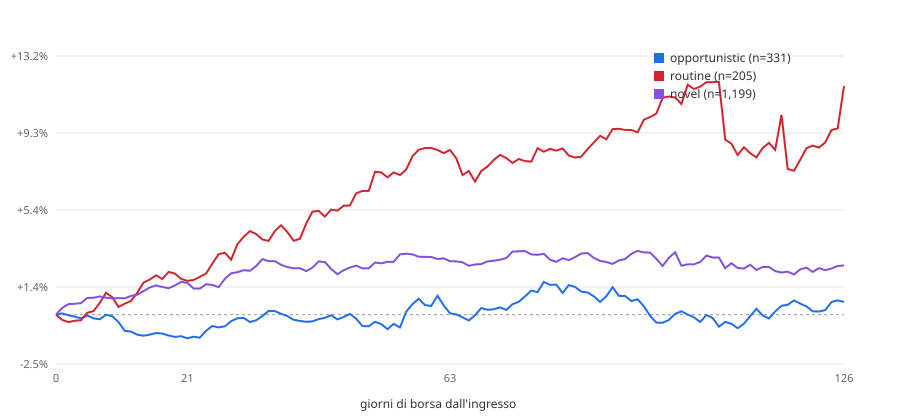

# Backtest event-time — acquisti insider vs Russell 2000 (EUR)

> **Public copy note.** Descriptive report of 2026-09-01, not pre-registered: the starting point of the US
> insider re-test, which ended **INCONCLUSIVE** once size-matched peers and placebos were added. Read it together
> with `backtest/rematch_50_300m/STUDY.md`. Where a dilution gate appears, it is a predicate defined for these
> reports and the re-test, **not a validated filter**.

Generato il 2026-09-01-dilution-50-300M. Rieseguibile con:

```
python tools/backtest_event_time.py --horizons 21,63,126 --benchmark iwm --cost-bps 100 --start 2015-01-01 --gate dilution --cap-bucket 50-300M
```

## Popolazione

**Questi non sono segnali.** Lo scanner non ha mai girato sullo storico: l'archivio observations copre tre giorni di run e il suo acquisto piu' vecchio e' di giugno 2026. La popolazione qui e' il corpus — acquisti open-market codice P, non derivati, non 10b5-1 — che non ha passato il cancello diluizione e non ha uno `score_v3`, perche' nessuno dei due esisteva quando quei Form 4 sono stati depositati.

| | |
|---|---:|
| eventi (emittente x data di deposito) | 7,811 |
| di cui misurabili (`OK` o `PARTIAL`) | 7,788 |
| `DELISTED_NO_DATA` | 17 |
| `NO_ENTRY_BAR` | 6 |
| `NO_BENCH_BAR` | 0 |
| benchmark | `IWM` |
| costo round trip | 1.00% |

## Aggregato, excess lordo

### (a) tutti gli eventi

| | n | media | mediana | dev.std | hit rate | t | IC 95% |
|---|---:|---:|---:|---:|---:|---:|---:|
| **21 giorni** | 7,785 | +0.85% | -0.55% | +16.99% | 48% | 4.43 | +0.50% – +1.24% |
| **63 giorni** | 7,782 | +2.68% | -1.21% | +32.39% | 47% | 7.31 | +1.94% – +3.37% |
| **126 giorni** | 7,665 | +4.13% | -2.34% | +48.19% | 47% | 7.50 | +3.15% – +5.21% |

### (b) un evento per emittente, cooldown 126gg

| | n | media | mediana | dev.std | hit rate | t | IC 95% |
|---|---:|---:|---:|---:|---:|---:|---:|
| **21 giorni** | 3,260 | +0.76% | -0.49% | +16.86% | 48% | 2.58 | +0.17% – +1.36% |
| **63 giorni** | 3,259 | +2.81% | -1.09% | +33.14% | 47% | 4.84 | +1.70% – +3.87% |
| **126 giorni** | 3,213 | +3.50% | -1.94% | +46.07% | 48% | 4.30 | +1.95% – +5.19% |

## Aggregato, excess netto del costo

| | n | media | mediana | dev.std | hit rate | t | IC 95% |
|---|---:|---:|---:|---:|---:|---:|---:|
| **21 giorni** | 3,260 | -0.24% | -1.49% | +16.86% | 44% | -0.81 | -0.83% – +0.36% |
| **63 giorni** | 3,259 | +1.81% | -2.09% | +33.14% | 45% | 3.12 | +0.70% – +2.87% |
| **126 giorni** | 3,213 | +2.50% | -2.94% | +46.07% | 46% | 3.07 | +0.95% – +4.19% |

_Variante (b). Il costo e' un haircut sulla gamba titolo._

---

## Spaccature a 21 giorni — variante (b)

### Tre classi (mappatura dichiarata, confrontabile con Table III di CMP)

| | n | media | mediana | dev.std | hit rate | t | IC 95% |
|---|---:|---:|---:|---:|---:|---:|---:|
| **OPPORTUNISTIC** | 331 | -1.21% | -1.84% | +12.96% | 42% | -1.70 | -2.68% – +0.25% |
| **UNCLASSIFIED** | 2,724 | +0.93% | -0.33% | +17.29% | 49% | 2.80 | +0.29% – +1.62% |
| **ROUTINE** | 205 | +1.73% | -0.74% | +16.53% | 47% | 1.50 | -0.30% – +4.05% |

`UNCLASSIFIED` = `novel` + `sparse` + `unseasoned`. Un evento e' `ROUTINE` solo se **tutti** i compratori lo sono.

### Cinque classi native

| | n | media | mediana | dev.std | hit rate | t | IC 95% |
|---|---:|---:|---:|---:|---:|---:|---:|
| **opportunistic** | 331 | -1.21% | -1.84% | +12.96% | 42% | -1.70 | -2.68% – +0.25% |
| **novel** | 1,198 | +1.63% | -0.10% | +19.55% | 49% | 2.89 | +0.52% – +2.76% |
| **sparse** | 1,526 | +0.37% | -0.56% | +15.27% | 48% | 0.95 | -0.39% – +1.10% |
| **routine** | 205 | +1.73% | -0.74% | +16.53% | 47% | 1.50 | -0.30% – +4.05% |

### Numero di compratori distinti

| | n | media | mediana | dev.std | hit rate | t | IC 95% |
|---|---:|---:|---:|---:|---:|---:|---:|
| **1 compratore** | 2,527 | +0.78% | -0.38% | +15.45% | 48% | 2.55 | +0.18% – +1.34% |
| **2 compratori** | 355 | +2.62% | -0.70% | +25.42% | 48% | 1.94 | +0.25% – +5.42% |
| **3 o piu'** | 378 | -1.14% | -1.52% | +15.67% | 44% | -1.42 | -2.65% – +0.27% |

### Anno di deposito

| | n | media | mediana | dev.std | hit rate | t | IC 95% |
|---|---:|---:|---:|---:|---:|---:|---:|
| **2015** | 218 | +1.16% | +0.11% | +12.25% | 51% | 1.40 | -0.43% – +2.87% |
| **2016** | 195 | +1.91% | +0.42% | +13.18% | 53% | 2.02 | +0.05% – +3.80% |
| **2017** | 199 | +1.55% | -0.89% | +14.72% | 45% | 1.48 | -0.30% – +3.69% |
| **2018** | 209 | -0.08% | -0.16% | +10.08% | 50% | -0.11 | -1.43% – +1.38% |
| **2019** | 227 | +1.12% | -0.28% | +11.85% | 49% | 1.42 | -0.36% – +2.68% |
| **2020** | 378 | +1.03% | -1.61% | +25.68% | 46% | 0.78 | -1.46% – +3.58% |
| **2021** | 247 | +1.77% | +0.32% | +14.62% | 53% | 1.91 | +0.05% – +3.83% |
| **2022** | 402 | -0.58% | -0.83% | +15.13% | 47% | -0.77 | -2.02% – +0.91% |
| **2023** | 415 | +0.82% | -0.36% | +17.16% | 48% | 0.97 | -0.86% – +2.44% |
| **2024** | 339 | -0.29% | -1.56% | +17.20% | 44% | -0.31 | -2.11% – +1.44% |
| **2025** | 351 | +1.54% | -0.80% | +18.68% | 46% | 1.55 | -0.44% – +3.43% |
| **2026** | 80 | -0.85% | -2.20% | +17.90% | 44% | -0.42 | -4.62% – +3.41% |

---

## Spaccature a 63 giorni — variante (b)

### Tre classi (mappatura dichiarata, confrontabile con Table III di CMP)

| | n | media | mediana | dev.std | hit rate | t | IC 95% |
|---|---:|---:|---:|---:|---:|---:|---:|
| **OPPORTUNISTIC** | 331 | +0.07% | -1.94% | +27.52% | 44% | 0.05 | -2.75% – +3.29% |
| **UNCLASSIFIED** | 2,723 | +2.72% | -1.06% | +32.71% | 48% | 4.34 | +1.53% – +3.99% |
| **ROUTINE** | 205 | +8.44% | -0.05% | +44.57% | 49% | 2.71 | +3.28% – +14.77% |

`UNCLASSIFIED` = `novel` + `sparse` + `unseasoned`. Un evento e' `ROUTINE` solo se **tutti** i compratori lo sono.

### Cinque classi native

| | n | media | mediana | dev.std | hit rate | t | IC 95% |
|---|---:|---:|---:|---:|---:|---:|---:|
| **opportunistic** | 331 | +0.07% | -1.94% | +27.52% | 44% | 0.05 | -2.75% – +3.29% |
| **novel** | 1,197 | +2.74% | -1.29% | +34.51% | 47% | 2.75 | +0.90% – +4.56% |
| **sparse** | 1,526 | +2.70% | -1.00% | +31.24% | 48% | 3.38 | +1.24% – +4.40% |
| **routine** | 205 | +8.44% | -0.05% | +44.57% | 49% | 2.71 | +3.28% – +14.77% |

### Numero di compratori distinti

| | n | media | mediana | dev.std | hit rate | t | IC 95% |
|---|---:|---:|---:|---:|---:|---:|---:|
| **1 compratore** | 2,527 | +2.79% | -0.98% | +32.93% | 48% | 4.26 | +1.55% – +3.99% |
| **2 compratori** | 354 | +2.68% | -2.99% | +36.10% | 44% | 1.39 | -0.78% – +6.57% |
| **3 o piu'** | 378 | +3.05% | -0.97% | +31.65% | 48% | 1.87 | -0.00% – +6.31% |

### Anno di deposito

| | n | media | mediana | dev.std | hit rate | t | IC 95% |
|---|---:|---:|---:|---:|---:|---:|---:|
| **2015** | 218 | +1.44% | +0.86% | +19.58% | 54% | 1.08 | -1.05% – +4.14% |
| **2016** | 195 | +5.18% | +2.64% | +27.43% | 55% | 2.64 | +1.51% – +9.10% |
| **2017** | 199 | +5.86% | +1.56% | +27.25% | 55% | 3.04 | +2.11% – +9.88% |
| **2018** | 209 | +3.07% | -0.11% | +20.47% | 50% | 2.17 | +0.38% – +6.10% |
| **2019** | 227 | -0.27% | -0.59% | +22.76% | 47% | -0.18 | -2.97% – +2.66% |
| **2020** | 377 | +4.83% | -4.90% | +45.17% | 40% | 2.08 | +0.73% – +9.72% |
| **2021** | 247 | +3.40% | +1.63% | +27.86% | 57% | 1.92 | +0.09% – +7.06% |
| **2022** | 402 | +0.76% | -2.43% | +28.50% | 45% | 0.54 | -2.02% – +3.54% |
| **2023** | 415 | +2.09% | -2.48% | +35.73% | 45% | 1.19 | -1.14% – +5.75% |
| **2024** | 339 | +2.74% | -1.48% | +37.54% | 47% | 1.34 | -1.03% – +6.70% |
| **2025** | 351 | +2.97% | -2.74% | +40.71% | 42% | 1.37 | -0.75% – +7.23% |
| **2026** | 80 | +3.51% | -4.57% | +38.85% | 38% | 0.81 | -4.30% – +12.03% |

---

## Spaccature a 126 giorni — variante (b)

### Tre classi (mappatura dichiarata, confrontabile con Table III di CMP)

| | n | media | mediana | dev.std | hit rate | t | IC 95% |
|---|---:|---:|---:|---:|---:|---:|---:|
| **OPPORTUNISTIC** | 325 | +0.66% | -3.86% | +36.12% | 45% | 0.33 | -3.26% – +4.77% |
| **UNCLASSIFIED** | 2,686 | +3.22% | -1.98% | +46.17% | 47% | 3.62 | +1.47% – +4.88% |
| **ROUTINE** | 202 | +11.71% | +1.53% | +57.06% | 53% | 2.92 | +4.62% – +20.80% |

`UNCLASSIFIED` = `novel` + `sparse` + `unseasoned`. Un evento e' `ROUTINE` solo se **tutti** i compratori lo sono.

### Cinque classi native

| | n | media | mediana | dev.std | hit rate | t | IC 95% |
|---|---:|---:|---:|---:|---:|---:|---:|
| **opportunistic** | 325 | +0.66% | -3.86% | +36.12% | 45% | 0.33 | -3.26% – +4.77% |
| **novel** | 1,185 | +2.52% | -2.41% | +46.49% | 46% | 1.87 | -0.10% – +5.17% |
| **sparse** | 1,501 | +3.78% | -1.66% | +45.93% | 48% | 3.19 | +1.57% – +6.30% |
| **routine** | 202 | +11.71% | +1.53% | +57.06% | 53% | 2.92 | +4.62% – +20.80% |

### Numero di compratori distinti

| | n | media | mediana | dev.std | hit rate | t | IC 95% |
|---|---:|---:|---:|---:|---:|---:|---:|
| **1 compratore** | 2,489 | +3.80% | -1.65% | +45.96% | 48% | 4.13 | +2.13% – +5.69% |
| **2 compratori** | 350 | +0.96% | -4.79% | +46.79% | 45% | 0.38 | -3.96% – +6.09% |
| **3 o piu'** | 374 | +3.84% | -2.46% | +46.17% | 46% | 1.61 | -0.61% – +8.67% |

### Anno di deposito

| | n | media | mediana | dev.std | hit rate | t | IC 95% |
|---|---:|---:|---:|---:|---:|---:|---:|
| **2015** | 218 | +3.25% | +1.16% | +25.52% | 53% | 1.88 | +0.04% – +6.91% |
| **2016** | 195 | +6.68% | +3.47% | +31.92% | 57% | 2.92 | +2.49% – +11.19% |
| **2017** | 197 | +6.09% | +2.35% | +38.78% | 54% | 2.20 | +0.74% – +11.73% |
| **2018** | 209 | +3.16% | +0.42% | +28.87% | 52% | 1.58 | -0.48% – +7.25% |
| **2019** | 227 | +0.44% | -4.87% | +35.65% | 43% | 0.19 | -4.04% – +5.30% |
| **2020** | 376 | +5.27% | -9.57% | +60.77% | 43% | 1.68 | -0.43% – +11.91% |
| **2021** | 246 | +3.88% | +4.90% | +37.83% | 57% | 1.61 | -0.51% – +8.81% |
| **2022** | 402 | +2.31% | -3.40% | +43.34% | 45% | 1.07 | -1.86% – +6.85% |
| **2023** | 415 | +2.31% | -5.50% | +47.29% | 42% | 1.00 | -2.18% – +6.72% |
| **2024** | 339 | +7.14% | +1.79% | +53.73% | 52% | 2.45 | +1.34% – +12.51% |
| **2025** | 351 | +0.19% | -8.99% | +59.43% | 40% | 0.06 | -5.52% – +6.42% |
| **2026** | 38 | -1.23% | -3.44% | +46.45% | 45% | -0.16 | -14.61% – +14.13% |

---

## Curva event-time

Excess medio cumulato giorno per giorno da 0 a 126, variante (b). E' il confronto diretto con la Figura 3 di CMP.



Dati: `backtest-event-time-curve-2026-09-01-dilution-50-300M.csv`, 127 punti.

| classe | giorno 21 | giorno 63 | giorno 126 | n al giorno 0 |
|---|---:|---:|---:|---:|
| novel | +1.63% | +2.74% | +2.52% | 1,199 |
| opportunistic | -1.21% | +0.07% | +0.66% | 331 |
| routine | +1.73% | +8.44% | +11.71% | 205 |
| sparse | +0.37% | +2.70% | +3.78% | 1,527 |

---

## Quanto vale il 0.2% senza prezzi

Gli eventi senza serie prezzi non sono un campione neutro: sono i falliti e i delistati. Il panel storico pero' un excess a 6 mesi ce l'ha, calcolato ai tempi **contro il fattore di mercato Fama-French** — un altro benchmark, quindi il confronto dice la direzione e l'ordine di grandezza, non il centesimo.

| | n | media | mediana | dev.std | hit rate | t | IC 95% |
|---|---:|---:|---:|---:|---:|---:|---:|
| **senza serie prezzi** | 174 | +30.03% | +10.94% | +75.43% | 59% | 5.25 | +19.28% – +41.83% |
| **con serie prezzi** | 62,005 | +2.71% | -2.76% | +48.24% | 46% | 13.97 | +2.33% – +3.12% |

Scarto fra le due medie: **+27.33%**. Gli esclusi sono andati **meglio**: il verso della distorsione non e' quello atteso, e va guardato.

---

## Limiti

1. **Survivorship.** 17 eventi su 7,811 non hanno serie prezzi (0.2%). Non e' rumore: e' la parte del campione che e' fallita. La sezione qui sopra la quantifica.
2. **Periodo coperto:** depositi dal 2015-01-01 in poi; il corpus arriva al 2026Q1. Gli eventi troppo recenti per chiudere un orizzonte sono `PARTIAL` e non entrano negli aggregati.
3. **Costo assunto:** 1.00% round trip, come haircut sulla gamba titolo. Non include lo spread denaro-lettera delle nano-cap, che su questo universo e' la voce piu' grande.
4. **Eventi sovrapposti.** La variante (a) conta lo stesso emittente decine di volte dentro la stessa finestra di 126 giorni e la sua t-stat e' gonfiata. La (b) e' quella da leggere.
5. **`unseasoned` non compare**: distinguerlo da `novel` richiede la prima data di deposito del CIK, che il corpus non porta.
6. **Barre oltre il ±500% scartate** (`ARTEFACT = 5.0`), stessa regola del resto del repo.
7. **Benchmark UCITS:** con `--benchmark xrs2` mancano le prime nove settimane del 2015, e TER piu' tracking error gonfiano leggermente l'excess a favore della strategia.

### Incoerenze trovate nei dati, non corrette

- `total_buy_usd = 305.496.908.725` su una riga del panel: 305 miliardi su un singolo cluster, quasi certamente azioni x prezzo su un campo sbagliato.
- Una `transaction_date` del **2006-08-28** dentro le observations di agosto 2026: deposito tardivo o amendment.

Nessuna delle due e' stata corretta: non e' il compito di questo backtest.
