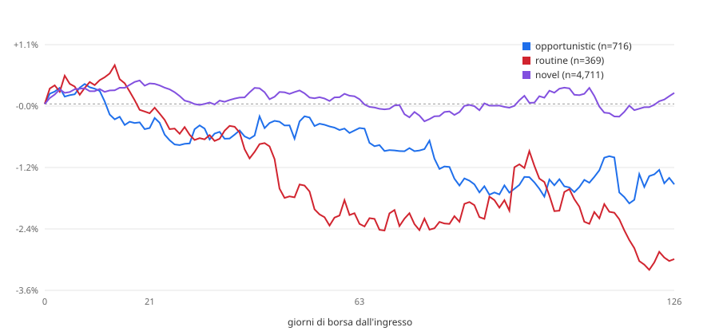

# Backtest event-time — acquisti insider vs Russell 2000 (EUR)

> **Public copy note.** Descriptive report of 2026-09-01, not pre-registered: the starting point of the US
> insider re-test, which ended **INCONCLUSIVE** once size-matched peers and placebos were added. Read it together
> with `backtest/rematch_50_300m/STUDY.md`. Where a dilution gate appears, it is a predicate defined for these
> reports and the re-test, **not a validated filter**.

Generato il 2026-09-01-dilution-gt300M. Rieseguibile con:

```
python tools/backtest_event_time.py --horizons 21,63,126 --benchmark iwm --cost-bps 100 --start 2015-01-01 --gate dilution --cap-bucket >300M
```

## Popolazione

**Questi non sono segnali.** Lo scanner non ha mai girato sullo storico: l'archivio observations copre tre giorni di run e il suo acquisto piu' vecchio e' di giugno 2026. La popolazione qui e' il corpus — acquisti open-market codice P, non derivati, non 10b5-1 — che non ha passato il cancello diluizione e non ha uno `score_v3`, perche' nessuno dei due esisteva quando quei Form 4 sono stati depositati.

| | |
|---|---:|
| eventi (emittente x data di deposito) | 22,117 |
| di cui misurabili (`OK` o `PARTIAL`) | 22,064 |
| `DELISTED_NO_DATA` | 53 |
| `NO_ENTRY_BAR` | 0 |
| `NO_BENCH_BAR` | 0 |
| benchmark | `IWM` |
| costo round trip | 1.00% |

## Aggregato, excess lordo

### (a) tutti gli eventi

| | n | media | mediana | dev.std | hit rate | t | IC 95% |
|---|---:|---:|---:|---:|---:|---:|---:|
| **21 giorni** | 22,054 | -0.06% | -0.56% | +13.79% | 47% | -0.60 | -0.26% – +0.12% |
| **63 giorni** | 22,049 | -0.41% | -1.54% | +25.47% | 46% | -2.39 | -0.73% – -0.06% |
| **126 giorni** | 21,694 | -1.29% | -3.15% | +36.18% | 45% | -5.23 | -1.78% – -0.80% |

### (b) un evento per emittente, cooldown 126gg

| | n | media | mediana | dev.std | hit rate | t | IC 95% |
|---|---:|---:|---:|---:|---:|---:|---:|
| **21 giorni** | 9,805 | +0.18% | -0.36% | +13.75% | 48% | 1.27 | -0.09% – +0.45% |
| **63 giorni** | 9,801 | +0.07% | -0.75% | +25.09% | 48% | 0.28 | -0.40% – +0.55% |
| **126 giorni** | 9,638 | -0.32% | -2.06% | +35.82% | 46% | -0.88 | -1.00% – +0.40% |

## Aggregato, excess netto del costo

| | n | media | mediana | dev.std | hit rate | t | IC 95% |
|---|---:|---:|---:|---:|---:|---:|---:|
| **21 giorni** | 9,805 | -0.82% | -1.36% | +13.75% | 43% | -5.93 | -1.09% – -0.55% |
| **63 giorni** | 9,801 | -0.93% | -1.75% | +25.09% | 46% | -3.67 | -1.40% – -0.45% |
| **126 giorni** | 9,638 | -1.32% | -3.06% | +35.82% | 45% | -3.62 | -2.00% – -0.60% |

_Variante (b). Il costo e' un haircut sulla gamba titolo._

---

## Spaccature a 21 giorni — variante (b)

### Tre classi (mappatura dichiarata, confrontabile con Table III di CMP)

| | n | media | mediana | dev.std | hit rate | t | IC 95% |
|---|---:|---:|---:|---:|---:|---:|---:|
| **OPPORTUNISTIC** | 716 | -0.46% | -0.47% | +11.79% | 48% | -1.04 | -1.32% – +0.37% |
| **UNCLASSIFIED** | 8,720 | +0.24% | -0.33% | +13.93% | 48% | 1.64 | -0.05% – +0.55% |
| **ROUTINE** | 369 | -0.18% | -0.73% | +13.09% | 46% | -0.26 | -1.36% – +1.20% |

`UNCLASSIFIED` = `novel` + `sparse` + `unseasoned`. Un evento e' `ROUTINE` solo se **tutti** i compratori lo sono.

### Cinque classi native

| | n | media | mediana | dev.std | hit rate | t | IC 95% |
|---|---:|---:|---:|---:|---:|---:|---:|
| **opportunistic** | 716 | -0.46% | -0.47% | +11.79% | 48% | -1.04 | -1.32% – +0.37% |
| **novel** | 4,709 | +0.39% | -0.24% | +13.66% | 49% | 1.97 | +0.01% – +0.78% |
| **sparse** | 4,011 | +0.07% | -0.39% | +14.23% | 48% | 0.31 | -0.35% – +0.54% |
| **routine** | 369 | -0.18% | -0.73% | +13.09% | 46% | -0.26 | -1.36% – +1.20% |

### Numero di compratori distinti

| | n | media | mediana | dev.std | hit rate | t | IC 95% |
|---|---:|---:|---:|---:|---:|---:|---:|
| **1 compratore** | 8,204 | +0.15% | -0.36% | +13.18% | 48% | 1.05 | -0.13% – +0.46% |
| **2 compratori** | 889 | -0.19% | -0.40% | +14.94% | 48% | -0.37 | -1.21% – +0.81% |
| **3 o piu'** | 712 | +0.90% | -0.24% | +17.96% | 49% | 1.34 | -0.38% – +2.24% |

### Anno di deposito

| | n | media | mediana | dev.std | hit rate | t | IC 95% |
|---|---:|---:|---:|---:|---:|---:|---:|
| **2015** | 809 | +0.37% | -0.09% | +12.42% | 50% | 0.85 | -0.41% – +1.22% |
| **2016** | 694 | +0.55% | -0.78% | +12.72% | 46% | 1.14 | -0.27% – +1.52% |
| **2017** | 669 | +1.08% | +0.36% | +12.20% | 53% | 2.29 | +0.26% – +2.06% |
| **2018** | 878 | +0.34% | -0.13% | +9.74% | 49% | 1.03 | -0.26% – +1.01% |
| **2019** | 749 | +0.70% | +0.13% | +11.05% | 51% | 1.74 | -0.05% – +1.49% |
| **2020** | 950 | -1.04% | -1.84% | +18.82% | 43% | -1.70 | -2.23% – +0.16% |
| **2021** | 861 | +1.36% | +0.54% | +12.95% | 52% | 3.08 | +0.50% – +2.16% |
| **2022** | 1,076 | +0.33% | +0.10% | +16.22% | 51% | 0.67 | -0.56% – +1.35% |
| **2023** | 973 | -0.17% | -0.39% | +13.17% | 49% | -0.40 | -0.99% – +0.63% |
| **2024** | 831 | +0.02% | -0.39% | +13.83% | 48% | 0.04 | -0.86% – +0.97% |
| **2025** | 1,042 | -0.32% | -0.99% | +13.97% | 44% | -0.75 | -1.13% – +0.54% |
| **2026** | 273 | -2.01% | -1.49% | +12.76% | 43% | -2.61 | -3.54% – -0.49% |

---

## Spaccature a 63 giorni — variante (b)

### Tre classi (mappatura dichiarata, confrontabile con Table III di CMP)

| | n | media | mediana | dev.std | hit rate | t | IC 95% |
|---|---:|---:|---:|---:|---:|---:|---:|
| **OPPORTUNISTIC** | 716 | -0.46% | -1.34% | +26.35% | 47% | -0.47 | -2.32% – +1.54% |
| **UNCLASSIFIED** | 8,716 | +0.21% | -0.62% | +25.08% | 48% | 0.80 | -0.27% – +0.77% |
| **ROUTINE** | 369 | -2.29% | -2.44% | +22.63% | 42% | -1.95 | -4.40% – -0.16% |

`UNCLASSIFIED` = `novel` + `sparse` + `unseasoned`. Un evento e' `ROUTINE` solo se **tutti** i compratori lo sono.

### Cinque classi native

| | n | media | mediana | dev.std | hit rate | t | IC 95% |
|---|---:|---:|---:|---:|---:|---:|---:|
| **opportunistic** | 716 | -0.46% | -1.34% | +26.35% | 47% | -0.47 | -2.32% – +1.54% |
| **novel** | 4,707 | +0.09% | -0.59% | +24.73% | 49% | 0.25 | -0.61% – +0.79% |
| **sparse** | 4,009 | +0.36% | -0.67% | +25.48% | 48% | 0.90 | -0.40% – +1.12% |
| **routine** | 369 | -2.29% | -2.44% | +22.63% | 42% | -1.95 | -4.40% – -0.16% |

### Numero di compratori distinti

| | n | media | mediana | dev.std | hit rate | t | IC 95% |
|---|---:|---:|---:|---:|---:|---:|---:|
| **1 compratore** | 8,200 | +0.32% | -0.53% | +24.56% | 49% | 1.16 | -0.22% – +0.86% |
| **2 compratori** | 889 | -1.39% | -2.33% | +27.56% | 45% | -1.50 | -3.15% – +0.37% |
| **3 o piu'** | 712 | -0.92% | -2.50% | +27.68% | 46% | -0.89 | -2.82% – +1.24% |

### Anno di deposito

| | n | media | mediana | dev.std | hit rate | t | IC 95% |
|---|---:|---:|---:|---:|---:|---:|---:|
| **2015** | 809 | +0.63% | +1.04% | +18.82% | 53% | 0.95 | -0.52% – +2.03% |
| **2016** | 694 | +0.70% | -1.05% | +23.65% | 47% | 0.77 | -0.93% – +2.44% |
| **2017** | 668 | +1.48% | +0.22% | +24.16% | 51% | 1.59 | -0.19% – +3.46% |
| **2018** | 878 | +0.95% | +1.39% | +17.70% | 54% | 1.60 | -0.15% – +2.16% |
| **2019** | 749 | -0.47% | -0.87% | +20.80% | 47% | -0.62 | -1.85% – +1.10% |
| **2020** | 949 | +1.56% | -3.64% | +33.84% | 44% | 1.42 | -0.53% – +3.61% |
| **2021** | 861 | +0.88% | +1.32% | +24.81% | 54% | 1.04 | -0.77% – +2.62% |
| **2022** | 1,075 | -0.82% | -0.09% | +23.99% | 49% | -1.11 | -2.25% – +0.73% |
| **2023** | 972 | -1.32% | -1.24% | +22.95% | 47% | -1.80 | -2.72% – +0.10% |
| **2024** | 831 | +1.32% | -0.20% | +28.66% | 50% | 1.33 | -0.65% – +3.29% |
| **2025** | 1,042 | -1.23% | -2.94% | +28.14% | 43% | -1.41 | -2.82% – +0.48% |
| **2026** | 273 | -6.14% | -9.66% | +29.31% | 28% | -3.46 | -9.47% – -2.44% |

---

## Spaccature a 126 giorni — variante (b)

### Tre classi (mappatura dichiarata, confrontabile con Table III di CMP)

| | n | media | mediana | dev.std | hit rate | t | IC 95% |
|---|---:|---:|---:|---:|---:|---:|---:|
| **OPPORTUNISTIC** | 702 | -1.54% | -2.03% | +33.87% | 44% | -1.20 | -3.96% – +1.06% |
| **UNCLASSIFIED** | 8,575 | -0.11% | -1.96% | +35.94% | 47% | -0.28 | -0.89% – +0.63% |
| **ROUTINE** | 361 | -2.96% | -4.28% | +36.58% | 41% | -1.54 | -6.65% – +1.18% |

`UNCLASSIFIED` = `novel` + `sparse` + `unseasoned`. Un evento e' `ROUTINE` solo se **tutti** i compratori lo sono.

### Cinque classi native

| | n | media | mediana | dev.std | hit rate | t | IC 95% |
|---|---:|---:|---:|---:|---:|---:|---:|
| **opportunistic** | 702 | -1.54% | -2.03% | +33.87% | 44% | -1.20 | -3.96% – +1.06% |
| **novel** | 4,642 | +0.21% | -1.34% | +34.48% | 48% | 0.42 | -0.75% – +1.25% |
| **sparse** | 3,933 | -0.49% | -2.60% | +37.59% | 45% | -0.81 | -1.62% – +0.68% |
| **routine** | 361 | -2.96% | -4.28% | +36.58% | 41% | -1.54 | -6.65% – +1.18% |

### Numero di compratori distinti

| | n | media | mediana | dev.std | hit rate | t | IC 95% |
|---|---:|---:|---:|---:|---:|---:|---:|
| **1 compratore** | 8,058 | -0.08% | -1.63% | +34.86% | 47% | -0.21 | -0.90% – +0.70% |
| **2 compratori** | 876 | -1.98% | -5.22% | +36.77% | 41% | -1.60 | -4.26% – +0.39% |
| **3 o piu'** | 704 | -1.01% | -3.58% | +44.47% | 44% | -0.60 | -4.14% – +2.17% |

### Anno di deposito

| | n | media | mediana | dev.std | hit rate | t | IC 95% |
|---|---:|---:|---:|---:|---:|---:|---:|
| **2015** | 809 | +1.17% | +2.15% | +29.59% | 54% | 1.13 | -0.59% – +3.29% |
| **2016** | 694 | +0.54% | -2.34% | +36.93% | 47% | 0.39 | -1.99% – +3.21% |
| **2017** | 668 | +0.69% | -1.83% | +30.47% | 46% | 0.59 | -1.65% – +3.21% |
| **2018** | 878 | +0.92% | +0.38% | +23.18% | 51% | 1.18 | -0.48% – +2.51% |
| **2019** | 749 | -0.10% | -2.00% | +35.12% | 46% | -0.08 | -2.31% – +2.56% |
| **2020** | 946 | +0.17% | -7.95% | +44.43% | 41% | 0.12 | -2.57% – +3.14% |
| **2021** | 861 | +1.32% | +2.59% | +32.75% | 54% | 1.18 | -1.03% – +3.51% |
| **2022** | 1,075 | -1.89% | -2.05% | +31.87% | 47% | -1.94 | -3.69% – -0.03% |
| **2023** | 972 | -1.68% | -3.72% | +36.18% | 44% | -1.45 | -3.88% – +0.67% |
| **2024** | 832 | +1.26% | -1.22% | +44.60% | 47% | 0.82 | -1.69% – +4.23% |
| **2025** | 1,042 | -4.37% | -7.97% | +39.19% | 36% | -3.60 | -6.51% – -2.12% |
| **2026** | 112 | +2.37% | -3.31% | +48.94% | 40% | 0.51 | -5.72% – +11.67% |

---

## Curva event-time

Excess medio cumulato giorno per giorno da 0 a 126, variante (b). E' il confronto diretto con la Figura 3 di CMP.



Dati: `backtest-event-time-curve-2026-09-01-dilution-gt300M.csv`, 127 punti.

| classe | giorno 21 | giorno 63 | giorno 126 | n al giorno 0 |
|---|---:|---:|---:|---:|
| novel | +0.39% | +0.09% | +0.21% | 4,711 |
| opportunistic | -0.46% | -0.46% | -1.54% | 716 |
| routine | -0.18% | -2.29% | -2.96% | 369 |
| sparse | +0.07% | +0.36% | -0.49% | 4,015 |

---

## Quanto vale il 0.2% senza prezzi

Gli eventi senza serie prezzi non sono un campione neutro: sono i falliti e i delistati. Il panel storico pero' un excess a 6 mesi ce l'ha, calcolato ai tempi **contro il fattore di mercato Fama-French** — un altro benchmark, quindi il confronto dice la direzione e l'ordine di grandezza, non il centesimo.

| | n | media | mediana | dev.std | hit rate | t | IC 95% |
|---|---:|---:|---:|---:|---:|---:|---:|
| **senza serie prezzi** | 1,089 | +3.51% | +0.49% | +30.92% | 51% | 3.75 | +1.73% – +5.39% |
| **con serie prezzi** | 118,666 | +1.26% | -1.78% | +41.25% | 47% | 10.51 | +1.02% – +1.52% |

Scarto fra le due medie: **+2.25%**. Gli esclusi sono andati **meglio**: il verso della distorsione non e' quello atteso, e va guardato.

---

## Limiti

1. **Survivorship.** 53 eventi su 22,117 non hanno serie prezzi (0.2%). Non e' rumore: e' la parte del campione che e' fallita. La sezione qui sopra la quantifica.
2. **Periodo coperto:** depositi dal 2015-01-01 in poi; il corpus arriva al 2026Q1. Gli eventi troppo recenti per chiudere un orizzonte sono `PARTIAL` e non entrano negli aggregati.
3. **Costo assunto:** 1.00% round trip, come haircut sulla gamba titolo. Non include lo spread denaro-lettera delle nano-cap, che su questo universo e' la voce piu' grande.
4. **Eventi sovrapposti.** La variante (a) conta lo stesso emittente decine di volte dentro la stessa finestra di 126 giorni e la sua t-stat e' gonfiata. La (b) e' quella da leggere.
5. **`unseasoned` non compare**: distinguerlo da `novel` richiede la prima data di deposito del CIK, che il corpus non porta.
6. **Barre oltre il ±500% scartate** (`ARTEFACT = 5.0`), stessa regola del resto del repo.
7. **Benchmark UCITS:** con `--benchmark xrs2` mancano le prime nove settimane del 2015, e TER piu' tracking error gonfiano leggermente l'excess a favore della strategia.

### Incoerenze trovate nei dati, non corrette

- `total_buy_usd = 305.496.908.725` su una riga del panel: 305 miliardi su un singolo cluster, quasi certamente azioni x prezzo su un campo sbagliato.
- Una `transaction_date` del **2006-08-28** dentro le observations di agosto 2026: deposito tardivo o amendment.

Nessuna delle due e' stata corretta: non e' il compito di questo backtest.
