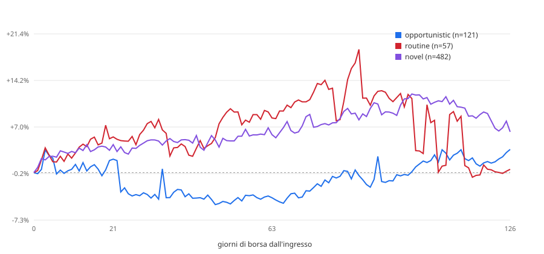

# Backtest event-time — acquisti insider vs Russell 2000 (EUR)

> **Public copy note.** Descriptive report of 2026-09-01, not pre-registered: the starting point of the US
> insider re-test, which ended **INCONCLUSIVE** once size-matched peers and placebos were added. Read it together
> with `backtest/rematch_50_300m/STUDY.md`. Where a dilution gate appears, it is a predicate defined for these
> reports and the re-test, **not a validated filter**.

Generato il 2026-09-01-dilution-lt50M. Rieseguibile con:

```
python tools/backtest_event_time.py --horizons 21,63,126 --benchmark iwm --cost-bps 100 --start 2015-01-01 --gate dilution --cap-bucket <50M
```

## Popolazione

**Questi non sono segnali.** Lo scanner non ha mai girato sullo storico: l'archivio observations copre tre giorni di run e il suo acquisto piu' vecchio e' di giugno 2026. La popolazione qui e' il corpus — acquisti open-market codice P, non derivati, non 10b5-1 — che non ha passato il cancello diluizione e non ha uno `score_v3`, perche' nessuno dei due esisteva quando quei Form 4 sono stati depositati.

| | |
|---|---:|
| eventi (emittente x data di deposito) | 2,325 |
| di cui misurabili (`OK` o `PARTIAL`) | 2,318 |
| `DELISTED_NO_DATA` | 7 |
| `NO_ENTRY_BAR` | 0 |
| `NO_BENCH_BAR` | 0 |
| benchmark | `IWM` |
| costo round trip | 1.00% |

## Aggregato, excess lordo

### (a) tutti gli eventi

| | n | media | mediana | dev.std | hit rate | t | IC 95% |
|---|---:|---:|---:|---:|---:|---:|---:|
| **21 giorni** | 2,315 | +2.02% | -1.32% | +28.50% | 45% | 3.41 | +0.95% – +3.24% |
| **63 giorni** | 2,309 | +4.28% | -2.50% | +48.89% | 45% | 4.21 | +2.26% – +6.34% |
| **126 giorni** | 2,253 | +2.72% | -6.26% | +56.27% | 42% | 2.29 | +0.76% – +5.10% |

### (b) un evento per emittente, cooldown 126gg

| | n | media | mediana | dev.std | hit rate | t | IC 95% |
|---|---:|---:|---:|---:|---:|---:|---:|
| **21 giorni** | 1,186 | +2.71% | -1.21% | +32.89% | 45% | 2.84 | +0.90% – +4.61% |
| **63 giorni** | 1,181 | +3.43% | -2.49% | +44.83% | 45% | 2.63 | +0.95% – +5.78% |
| **126 giorni** | 1,156 | +4.04% | -5.43% | +58.71% | 43% | 2.34 | +0.78% – +7.65% |

## Aggregato, excess netto del costo

| | n | media | mediana | dev.std | hit rate | t | IC 95% |
|---|---:|---:|---:|---:|---:|---:|---:|
| **21 giorni** | 1,186 | +1.71% | -2.21% | +32.89% | 41% | 1.79 | -0.10% – +3.61% |
| **63 giorni** | 1,181 | +2.43% | -3.49% | +44.83% | 43% | 1.86 | -0.05% – +4.78% |
| **126 giorni** | 1,156 | +3.04% | -6.43% | +58.71% | 42% | 1.76 | -0.22% – +6.65% |

_Variante (b). Il costo e' un haircut sulla gamba titolo._

---

## Spaccature a 21 giorni — variante (b)

### Tre classi (mappatura dichiarata, confrontabile con Table III di CMP)

| | n | media | mediana | dev.std | hit rate | t | IC 95% |
|---|---:|---:|---:|---:|---:|---:|---:|
| **OPPORTUNISTIC** | 121 | +2.06% | -1.83% | +41.71% | 40% | 0.54 | -3.44% – +11.20% |
| **UNCLASSIFIED** | 1,008 | +2.63% | -1.12% | +31.81% | 46% | 2.63 | +0.84% – +4.71% |
| **ROUTINE** | 57 | +5.49% | -1.31% | +30.92% | 47% | 1.34 | -1.71% – +13.71% |

`UNCLASSIFIED` = `novel` + `sparse` + `unseasoned`. Un evento e' `ROUTINE` solo se **tutti** i compratori lo sono.

### Cinque classi native

| | n | media | mediana | dev.std | hit rate | t | IC 95% |
|---|---:|---:|---:|---:|---:|---:|---:|
| **opportunistic** | 121 | +2.06% | -1.83% | +41.71% | 40% | 0.54 | -3.44% – +11.20% |
| **novel** | 482 | +4.31% | -0.83% | +36.84% | 48% | 2.57 | +1.24% – +7.57% |
| **sparse** | 526 | +1.10% | -1.59% | +26.31% | 44% | 0.95 | -1.02% – +3.27% |
| **routine** | 57 | +5.49% | -1.31% | +30.92% | 47% | 1.34 | -1.71% – +13.71% |

### Numero di compratori distinti

| | n | media | mediana | dev.std | hit rate | t | IC 95% |
|---|---:|---:|---:|---:|---:|---:|---:|
| **1 compratore** | 933 | +1.84% | -1.47% | +30.86% | 44% | 1.83 | +0.01% – +3.97% |
| **2 compratori** | 110 | +3.04% | -2.17% | +41.53% | 47% | 0.77 | -3.94% – +11.63% |
| **3 o piu'** | 143 | +8.11% | +0.69% | +37.66% | 51% | 2.58 | +2.35% – +14.60% |

### Anno di deposito

| | n | media | mediana | dev.std | hit rate | t | IC 95% |
|---|---:|---:|---:|---:|---:|---:|---:|
| **2015** | 93 | +1.05% | +0.18% | +19.88% | 52% | 0.51 | -2.92% – +5.24% |
| **2016** | 107 | +1.98% | -0.38% | +27.07% | 49% | 0.76 | -2.63% – +7.76% |
| **2017** | 84 | +3.60% | -1.26% | +38.84% | 44% | 0.85 | -3.83% – +12.80% |
| **2018** | 75 | -1.22% | -1.40% | +16.81% | 45% | -0.63 | -4.68% – +2.62% |
| **2019** | 91 | +2.95% | -0.20% | +15.58% | 48% | 1.81 | +0.20% – +6.24% |
| **2020** | 100 | -0.49% | -5.01% | +24.82% | 34% | -0.20 | -4.92% – +4.80% |
| **2021** | 70 | +1.13% | -0.23% | +22.25% | 50% | 0.43 | -3.50% – +6.41% |
| **2022** | 119 | +6.99% | +1.12% | +34.00% | 55% | 2.24 | +1.52% – +13.17% |
| **2023** | 144 | +5.28% | -1.42% | +43.84% | 46% | 1.44 | -0.68% – +12.95% |
| **2024** | 137 | +0.81% | -3.78% | +34.34% | 37% | 0.27 | -4.18% – +6.55% |
| **2025** | 139 | +5.48% | -2.67% | +45.67% | 44% | 1.41 | -1.38% – +13.64% |
| **2026** | 27 | -2.58% | -11.85% | +37.60% | 33% | -0.36 | -13.72% – +10.35% |

---

## Spaccature a 63 giorni — variante (b)

### Tre classi (mappatura dichiarata, confrontabile con Table III di CMP)

| | n | media | mediana | dev.std | hit rate | t | IC 95% |
|---|---:|---:|---:|---:|---:|---:|---:|
| **OPPORTUNISTIC** | 120 | -3.87% | -0.89% | +25.59% | 48% | -1.66 | -8.18% – +0.34% |
| **UNCLASSIFIED** | 1,004 | +4.02% | -2.68% | +46.38% | 45% | 2.75 | +1.33% – +6.86% |
| **ROUTINE** | 57 | +8.40% | +0.90% | +47.79% | 51% | 1.33 | -2.23% – +22.03% |

`UNCLASSIFIED` = `novel` + `sparse` + `unseasoned`. Un evento e' `ROUTINE` solo se **tutti** i compratori lo sono.

### Cinque classi native

| | n | media | mediana | dev.std | hit rate | t | IC 95% |
|---|---:|---:|---:|---:|---:|---:|---:|
| **opportunistic** | 120 | -3.87% | -0.89% | +25.59% | 48% | -1.66 | -8.18% – +0.34% |
| **novel** | 478 | +5.84% | -0.75% | +48.78% | 49% | 2.62 | +1.71% – +10.59% |
| **sparse** | 526 | +2.37% | -4.14% | +44.07% | 41% | 1.23 | -1.29% – +6.00% |
| **routine** | 57 | +8.40% | +0.90% | +47.79% | 51% | 1.33 | -2.23% – +22.03% |

### Numero di compratori distinti

| | n | media | mediana | dev.std | hit rate | t | IC 95% |
|---|---:|---:|---:|---:|---:|---:|---:|
| **1 compratore** | 930 | +3.73% | -1.93% | +45.26% | 46% | 2.52 | +0.92% – +6.52% |
| **2 compratori** | 110 | -0.91% | -5.94% | +42.36% | 37% | -0.23 | -8.25% – +6.95% |
| **3 o piu'** | 141 | +4.83% | -0.99% | +43.98% | 48% | 1.30 | -2.08% – +12.12% |

### Anno di deposito

| | n | media | mediana | dev.std | hit rate | t | IC 95% |
|---|---:|---:|---:|---:|---:|---:|---:|
| **2015** | 93 | +4.35% | +4.62% | +30.90% | 60% | 1.36 | -1.96% – +10.61% |
| **2016** | 108 | +1.15% | -3.41% | +48.61% | 43% | 0.25 | -7.26% – +11.35% |
| **2017** | 84 | +3.98% | -3.20% | +44.67% | 38% | 0.82 | -5.41% – +14.12% |
| **2018** | 75 | -0.03% | -1.58% | +25.28% | 48% | -0.01 | -5.44% – +6.03% |
| **2019** | 90 | +4.56% | +0.19% | +28.54% | 51% | 1.52 | -1.23% – +10.24% |
| **2020** | 100 | +9.81% | -5.99% | +63.83% | 40% | 1.54 | -1.01% – +22.73% |
| **2021** | 70 | +4.12% | -3.65% | +45.34% | 44% | 0.76 | -5.51% – +14.69% |
| **2022** | 118 | +3.76% | -3.23% | +44.56% | 47% | 0.92 | -3.69% – +12.38% |
| **2023** | 143 | +4.66% | -2.50% | +52.74% | 43% | 1.06 | -3.12% – +14.42% |
| **2024** | 136 | +3.73% | -2.75% | +42.90% | 45% | 1.01 | -2.98% – +10.97% |
| **2025** | 137 | -1.88% | -6.91% | +42.44% | 43% | -0.52 | -8.27% – +5.49% |
| **2026** | 27 | +5.62% | -11.01% | +51.82% | 44% | 0.56 | -13.02% – +25.02% |

---

## Spaccature a 126 giorni — variante (b)

### Tre classi (mappatura dichiarata, confrontabile con Table III di CMP)

| | n | media | mediana | dev.std | hit rate | t | IC 95% |
|---|---:|---:|---:|---:|---:|---:|---:|
| **OPPORTUNISTIC** | 119 | +3.57% | -2.46% | +53.32% | 43% | 0.73 | -5.13% – +13.42% |
| **UNCLASSIFIED** | 982 | +4.29% | -5.53% | +59.50% | 43% | 2.26 | +0.76% – +8.22% |
| **ROUTINE** | 55 | +0.50% | -11.11% | +56.42% | 44% | 0.07 | -13.17% – +16.24% |

`UNCLASSIFIED` = `novel` + `sparse` + `unseasoned`. Un evento e' `ROUTINE` solo se **tutti** i compratori lo sono.

### Cinque classi native

| | n | media | mediana | dev.std | hit rate | t | IC 95% |
|---|---:|---:|---:|---:|---:|---:|---:|
| **opportunistic** | 119 | +3.57% | -2.46% | +53.32% | 43% | 0.73 | -5.13% – +13.42% |
| **novel** | 466 | +6.27% | -3.72% | +64.18% | 45% | 2.11 | +0.84% – +11.78% |
| **sparse** | 516 | +2.51% | -7.35% | +54.92% | 42% | 1.04 | -1.99% – +7.38% |
| **routine** | 55 | +0.50% | -11.11% | +56.42% | 44% | 0.07 | -13.17% – +16.24% |

### Numero di compratori distinti

| | n | media | mediana | dev.std | hit rate | t | IC 95% |
|---|---:|---:|---:|---:|---:|---:|---:|
| **1 compratore** | 910 | +4.87% | -4.44% | +57.58% | 44% | 2.55 | +1.08% – +9.03% |
| **2 compratori** | 108 | -6.41% | -10.65% | +51.33% | 37% | -1.30 | -15.52% – +4.00% |
| **3 o piu'** | 138 | +6.75% | -7.59% | +70.02% | 43% | 1.13 | -3.58% – +18.81% |

### Anno di deposito

| | n | media | mediana | dev.std | hit rate | t | IC 95% |
|---|---:|---:|---:|---:|---:|---:|---:|
| **2015** | 93 | +4.08% | +0.36% | +44.80% | 53% | 0.88 | -4.80% – +12.89% |
| **2016** | 107 | +1.36% | -7.60% | +49.76% | 42% | 0.28 | -7.52% – +11.45% |
| **2017** | 83 | +2.61% | -5.71% | +53.32% | 40% | 0.45 | -8.32% – +14.24% |
| **2018** | 74 | +3.95% | -1.18% | +38.30% | 50% | 0.89 | -4.33% – +12.83% |
| **2019** | 89 | +14.35% | +3.70% | +53.71% | 56% | 2.52 | +3.73% – +25.48% |
| **2020** | 99 | +8.32% | -9.41% | +64.50% | 39% | 1.28 | -3.77% – +21.15% |
| **2021** | 69 | +4.82% | +0.41% | +51.68% | 51% | 0.77 | -6.74% – +18.13% |
| **2022** | 118 | +16.71% | -3.10% | +74.85% | 47% | 2.43 | +4.34% – +31.30% |
| **2023** | 140 | -1.11% | -7.46% | +56.76% | 38% | -0.23 | -9.98% – +9.07% |
| **2024** | 133 | +5.65% | -3.06% | +65.72% | 46% | 0.99 | -4.81% – +17.21% |
| **2025** | 136 | -6.11% | -20.09% | +65.43% | 31% | -1.09 | -16.37% – +4.95% |
| **2026** | 15 | -35.76% | -36.46% | +42.76% | 13% | -3.24 | -56.55% – -14.34% |

---

## Curva event-time

Excess medio cumulato giorno per giorno da 0 a 126, variante (b). E' il confronto diretto con la Figura 3 di CMP.



Dati: `backtest-event-time-curve-2026-09-01-dilution-lt50M.csv`, 127 punti.

| classe | giorno 21 | giorno 63 | giorno 126 | n al giorno 0 |
|---|---:|---:|---:|---:|
| novel | +4.31% | +5.84% | +6.27% | 482 |
| opportunistic | +2.06% | -3.87% | +3.57% | 121 |
| routine | +5.49% | +8.40% | +0.50% | 57 |
| sparse | +1.10% | +2.37% | +2.51% | 528 |

---

## Quanto vale il 0.3% senza prezzi

Gli eventi senza serie prezzi non sono un campione neutro: sono i falliti e i delistati. Il panel storico pero' un excess a 6 mesi ce l'ha, calcolato ai tempi **contro il fattore di mercato Fama-French** — un altro benchmark, quindi il confronto dice la direzione e l'ordine di grandezza, non il centesimo.

| | n | media | mediana | dev.std | hit rate | t | IC 95% |
|---|---:|---:|---:|---:|---:|---:|---:|
| **senza serie prezzi** | 235 | -16.71% | -15.53% | +37.96% | 29% | -6.75 | -21.23% – -11.92% |
| **con serie prezzi** | 23,108 | +1.33% | -6.70% | +56.80% | 41% | 3.55 | +0.58% – +2.01% |

Scarto fra le due medie: **-18.04%**. Gli esclusi sono andati **peggio**: ogni numero di questo documento e' sovrastimato di un ordine simile.

---

## Limiti

1. **Survivorship.** 7 eventi su 2,325 non hanno serie prezzi (0.3%). Non e' rumore: e' la parte del campione che e' fallita. La sezione qui sopra la quantifica.
2. **Periodo coperto:** depositi dal 2015-01-01 in poi; il corpus arriva al 2026Q1. Gli eventi troppo recenti per chiudere un orizzonte sono `PARTIAL` e non entrano negli aggregati.
3. **Costo assunto:** 1.00% round trip, come haircut sulla gamba titolo. Non include lo spread denaro-lettera delle nano-cap, che su questo universo e' la voce piu' grande.
4. **Eventi sovrapposti.** La variante (a) conta lo stesso emittente decine di volte dentro la stessa finestra di 126 giorni e la sua t-stat e' gonfiata. La (b) e' quella da leggere.
5. **`unseasoned` non compare**: distinguerlo da `novel` richiede la prima data di deposito del CIK, che il corpus non porta.
6. **Barre oltre il ±500% scartate** (`ARTEFACT = 5.0`), stessa regola del resto del repo.
7. **Benchmark UCITS:** con `--benchmark xrs2` mancano le prime nove settimane del 2015, e TER piu' tracking error gonfiano leggermente l'excess a favore della strategia.

### Incoerenze trovate nei dati, non corrette

- `total_buy_usd = 305.496.908.725` su una riga del panel: 305 miliardi su un singolo cluster, quasi certamente azioni x prezzo su un campo sbagliato.
- Una `transaction_date` del **2006-08-28** dentro le observations di agosto 2026: deposito tardivo o amendment.

Nessuna delle due e' stata corretta: non e' il compito di questo backtest.
