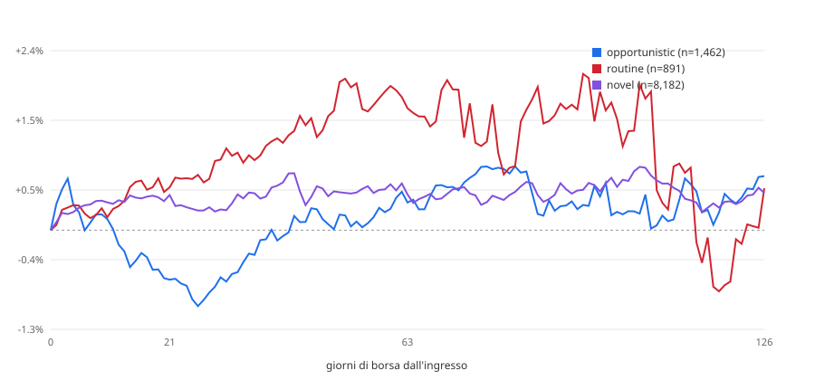

# Backtest event-time — acquisti insider vs Russell 2000 (EUR)

> **Public copy note.** Descriptive report of 2026-09-01, not pre-registered: the starting point of the US
> insider re-test, which ended **INCONCLUSIVE** once size-matched peers and placebos were added. Read it together
> with `backtest/rematch_50_300m/STUDY.md`. Where a dilution gate appears, it is a predicate defined for these
> reports and the re-test, **not a validated filter**.

Generato il 2026-09-01-dilution. Rieseguibile con:

```
python tools/backtest_event_time.py --horizons 21,63,126 --benchmark iwm --cost-bps 100 --start 2015-01-01 --gate dilution --cap-bucket all
```

## Popolazione

**Questi non sono segnali.** Lo scanner non ha mai girato sullo storico: l'archivio observations copre tre giorni di run e il suo acquisto piu' vecchio e' di giugno 2026. La popolazione qui e' il corpus — acquisti open-market codice P, non derivati, non 10b5-1 — che non ha passato il cancello diluizione e non ha uno `score_v3`, perche' nessuno dei due esisteva quando quei Form 4 sono stati depositati.

| | |
|---|---:|
| eventi (emittente x data di deposito) | 61,609 |
| di cui misurabili (`OK` o `PARTIAL`) | 43,938 |
| `DELISTED_NO_DATA` | 17,658 |
| `NO_ENTRY_BAR` | 13 |
| `NO_BENCH_BAR` | 0 |
| benchmark | `IWM` |
| costo round trip | 1.00% |

## Aggregato, excess lordo

### (a) tutti gli eventi

| | n | media | mediana | dev.std | hit rate | t | IC 95% |
|---|---:|---:|---:|---:|---:|---:|---:|
| **21 giorni** | 43,749 | +0.16% | -0.55% | +16.55% | 47% | 2.01 | +0.00% – +0.31% |
| **63 giorni** | 43,572 | +0.57% | -1.37% | +29.69% | 46% | 3.98 | +0.28% – +0.83% |
| **126 giorni** | 42,799 | +0.06% | -2.56% | +40.06% | 45% | 0.33 | -0.32% – +0.46% |

### (b) un evento per emittente, cooldown 126gg

| | n | media | mediana | dev.std | hit rate | t | IC 95% |
|---|---:|---:|---:|---:|---:|---:|---:|
| **21 giorni** | 18,084 | +0.30% | -0.46% | +17.40% | 48% | 2.29 | +0.07% – +0.55% |
| **63 giorni** | 18,004 | +0.74% | -1.02% | +29.61% | 47% | 3.37 | +0.34% – +1.18% |
| **126 giorni** | 17,667 | +0.55% | -2.00% | +40.11% | 46% | 1.83 | -0.03% – +1.08% |

## Aggregato, excess netto del costo

| | n | media | mediana | dev.std | hit rate | t | IC 95% |
|---|---:|---:|---:|---:|---:|---:|---:|
| **21 giorni** | 18,084 | -0.70% | -1.46% | +17.40% | 43% | -5.44 | -0.93% – -0.45% |
| **63 giorni** | 18,004 | -0.26% | -2.02% | +29.61% | 45% | -1.16 | -0.66% – +0.18% |
| **126 giorni** | 17,667 | -0.45% | -3.00% | +40.11% | 45% | -1.48 | -1.03% – +0.08% |

_Variante (b). Il costo e' un haircut sulla gamba titolo._

---

## Spaccature a 21 giorni — variante (b)

### Tre classi (mappatura dichiarata, confrontabile con Table III di CMP)

| | n | media | mediana | dev.std | hit rate | t | IC 95% |
|---|---:|---:|---:|---:|---:|---:|---:|
| **OPPORTUNISTIC** | 1,457 | -0.66% | -0.90% | +15.41% | 45% | -1.65 | -1.49% – +0.14% |
| **UNCLASSIFIED** | 15,739 | +0.37% | -0.41% | +17.68% | 48% | 2.62 | +0.08% – +0.64% |
| **ROUTINE** | 888 | +0.57% | -0.51% | +15.26% | 48% | 1.12 | -0.40% – +1.63% |

`UNCLASSIFIED` = `novel` + `sparse` + `unseasoned`. Un evento e' `ROUTINE` solo se **tutti** i compratori lo sono.

### Cinque classi native

| | n | media | mediana | dev.std | hit rate | t | IC 95% |
|---|---:|---:|---:|---:|---:|---:|---:|
| **opportunistic** | 1,457 | -0.66% | -0.90% | +15.41% | 45% | -1.65 | -1.49% – +0.14% |
| **novel** | 8,150 | +0.47% | -0.37% | +18.31% | 48% | 2.32 | +0.09% – +0.88% |
| **sparse** | 7,589 | +0.26% | -0.47% | +16.99% | 48% | 1.33 | -0.12% – +0.63% |
| **routine** | 888 | +0.57% | -0.51% | +15.26% | 48% | 1.12 | -0.40% – +1.63% |

### Numero di compratori distinti

| | n | media | mediana | dev.std | hit rate | t | IC 95% |
|---|---:|---:|---:|---:|---:|---:|---:|
| **1 compratore** | 14,642 | +0.19% | -0.50% | +16.20% | 48% | 1.40 | -0.07% – +0.47% |
| **2 compratori** | 1,811 | +1.00% | -0.17% | +22.74% | 49% | 1.86 | -0.05% – +2.02% |
| **3 o piu'** | 1,631 | +0.49% | -0.25% | +20.64% | 49% | 0.97 | -0.58% – +1.49% |

### Anno di deposito

| | n | media | mediana | dev.std | hit rate | t | IC 95% |
|---|---:|---:|---:|---:|---:|---:|---:|
| **2015** | 1,645 | +0.41% | +0.12% | +16.42% | 51% | 1.02 | -0.38% – +1.22% |
| **2016** | 1,411 | +0.32% | -0.78% | +15.85% | 46% | 0.75 | -0.46% – +1.13% |
| **2017** | 1,305 | +0.59% | -0.40% | +17.15% | 48% | 1.24 | -0.35% – +1.54% |
| **2018** | 1,549 | -0.08% | -0.21% | +11.79% | 49% | -0.26 | -0.66% – +0.53% |
| **2019** | 1,387 | +1.46% | +0.09% | +18.40% | 51% | 2.95 | +0.55% – +2.48% |
| **2020** | 1,758 | -0.65% | -2.17% | +22.28% | 42% | -1.22 | -1.71% – +0.37% |
| **2021** | 1,512 | +1.20% | +0.52% | +15.13% | 52% | 3.09 | +0.48% – +2.03% |
| **2022** | 1,930 | +0.27% | -0.07% | +18.11% | 50% | 0.66 | -0.53% – +1.09% |
| **2023** | 1,757 | +0.06% | -0.39% | +16.01% | 48% | 0.17 | -0.66% – +0.81% |
| **2024** | 1,573 | +0.00% | -0.52% | +17.40% | 47% | 0.00 | -0.91% – +0.95% |
| **2025** | 1,790 | +0.54% | -1.11% | +19.83% | 44% | 1.15 | -0.38% – +1.50% |
| **2026** | 467 | -1.56% | -1.10% | +16.22% | 45% | -2.08 | -3.01% – -0.15% |

---

## Spaccature a 63 giorni — variante (b)

### Tre classi (mappatura dichiarata, confrontabile con Table III di CMP)

| | n | media | mediana | dev.std | hit rate | t | IC 95% |
|---|---:|---:|---:|---:|---:|---:|---:|
| **OPPORTUNISTIC** | 1,452 | +0.37% | -1.20% | +29.15% | 47% | 0.48 | -1.01% – +1.82% |
| **UNCLASSIFIED** | 15,665 | +0.73% | -1.02% | +29.57% | 47% | 3.08 | +0.28% – +1.19% |
| **ROUTINE** | 887 | +1.64% | -1.02% | +31.18% | 47% | 1.56 | -0.36% – +4.01% |

`UNCLASSIFIED` = `novel` + `sparse` + `unseasoned`. Un evento e' `ROUTINE` solo se **tutti** i compratori lo sono.

### Cinque classi native

| | n | media | mediana | dev.std | hit rate | t | IC 95% |
|---|---:|---:|---:|---:|---:|---:|---:|
| **opportunistic** | 1,452 | +0.37% | -1.20% | +29.15% | 47% | 0.48 | -1.01% – +1.82% |
| **novel** | 8,111 | +0.48% | -0.93% | +29.47% | 48% | 1.47 | -0.14% – +1.12% |
| **sparse** | 7,554 | +0.99% | -1.08% | +29.67% | 47% | 2.91 | +0.37% – +1.66% |
| **routine** | 887 | +1.64% | -1.02% | +31.18% | 47% | 1.56 | -0.36% – +4.01% |

### Numero di compratori distinti

| | n | media | mediana | dev.std | hit rate | t | IC 95% |
|---|---:|---:|---:|---:|---:|---:|---:|
| **1 compratore** | 14,586 | +0.82% | -0.83% | +29.23% | 48% | 3.40 | +0.37% – +1.30% |
| **2 compratori** | 1,797 | -0.25% | -1.97% | +29.59% | 45% | -0.35 | -1.62% – +1.18% |
| **3 o piu'** | 1,621 | +1.13% | -1.72% | +32.88% | 47% | 1.38 | -0.43% – +2.68% |

### Anno di deposito

| | n | media | mediana | dev.std | hit rate | t | IC 95% |
|---|---:|---:|---:|---:|---:|---:|---:|
| **2015** | 1,634 | +0.88% | +0.55% | +23.21% | 52% | 1.53 | -0.27% – +1.94% |
| **2016** | 1,402 | +0.86% | -1.08% | +29.07% | 46% | 1.10 | -0.50% – +2.46% |
| **2017** | 1,297 | +2.20% | -0.11% | +28.63% | 50% | 2.77 | +0.55% – +3.70% |
| **2018** | 1,535 | +1.09% | +0.47% | +20.79% | 52% | 2.05 | +0.07% – +2.18% |
| **2019** | 1,382 | +0.72% | -0.37% | +24.53% | 48% | 1.09 | -0.51% – +1.96% |
| **2020** | 1,752 | +2.23% | -4.61% | +39.80% | 41% | 2.35 | +0.44% – +4.12% |
| **2021** | 1,506 | +1.01% | +1.20% | +26.58% | 54% | 1.47 | -0.23% – +2.43% |
| **2022** | 1,922 | -0.78% | -0.82% | +27.19% | 47% | -1.26 | -1.90% – +0.41% |
| **2023** | 1,753 | -0.08% | -1.55% | +31.03% | 46% | -0.11 | -1.53% – +1.47% |
| **2024** | 1,568 | +1.98% | -0.03% | +32.37% | 50% | 2.43 | +0.41% – +3.66% |
| **2025** | 1,786 | +0.16% | -2.99% | +33.95% | 42% | 0.19 | -1.34% – +1.70% |
| **2026** | 467 | -4.15% | -7.21% | +32.76% | 30% | -2.74 | -7.02% – -0.96% |

---

## Spaccature a 126 giorni — variante (b)

### Tre classi (mappatura dichiarata, confrontabile con Table III di CMP)

| | n | media | mediana | dev.std | hit rate | t | IC 95% |
|---|---:|---:|---:|---:|---:|---:|---:|
| **OPPORTUNISTIC** | 1,424 | +0.73% | -1.84% | +38.12% | 45% | 0.72 | -1.09% – +2.84% |
| **UNCLASSIFIED** | 15,377 | +0.54% | -2.04% | +40.26% | 46% | 1.65 | -0.12% – +1.17% |
| **ROUTINE** | 866 | +0.56% | -1.77% | +40.58% | 46% | 0.41 | -2.10% – +3.66% |

`UNCLASSIFIED` = `novel` + `sparse` + `unseasoned`. Un evento e' `ROUTINE` solo se **tutti** i compratori lo sono.

### Cinque classi native

| | n | media | mediana | dev.std | hit rate | t | IC 95% |
|---|---:|---:|---:|---:|---:|---:|---:|
| **opportunistic** | 1,424 | +0.73% | -1.84% | +38.12% | 45% | 0.72 | -1.09% – +2.84% |
| **novel** | 7,978 | +0.50% | -1.66% | +39.57% | 47% | 1.12 | -0.35% – +1.31% |
| **sparse** | 7,399 | +0.58% | -2.47% | +41.00% | 46% | 1.21 | -0.36% – +1.50% |
| **routine** | 866 | +0.56% | -1.77% | +40.58% | 46% | 0.41 | -2.10% – +3.66% |

### Numero di compratori distinti

| | n | media | mediana | dev.std | hit rate | t | IC 95% |
|---|---:|---:|---:|---:|---:|---:|---:|
| **1 compratore** | 14,312 | +0.61% | -1.71% | +38.91% | 47% | 1.89 | -0.01% – +1.26% |
| **2 compratori** | 1,765 | -0.54% | -3.69% | +41.03% | 44% | -0.55 | -2.35% – +1.39% |
| **3 o piu'** | 1,590 | +1.21% | -3.18% | +48.74% | 45% | 0.99 | -1.10% – +3.82% |

### Anno di deposito

| | n | media | mediana | dev.std | hit rate | t | IC 95% |
|---|---:|---:|---:|---:|---:|---:|---:|
| **2015** | 1,623 | +1.40% | +2.01% | +32.01% | 54% | 1.76 | -0.11% – +2.97% |
| **2016** | 1,393 | +0.43% | -2.31% | +36.71% | 47% | 0.43 | -1.37% – +2.31% |
| **2017** | 1,285 | +0.83% | -2.25% | +34.91% | 45% | 0.85 | -1.26% – +2.82% |
| **2018** | 1,522 | +1.89% | +0.64% | +27.39% | 51% | 2.69 | +0.44% – +3.27% |
| **2019** | 1,374 | +1.51% | -1.19% | +37.37% | 47% | 1.50 | -0.41% – +3.48% |
| **2020** | 1,743 | +1.99% | -8.41% | +53.60% | 40% | 1.55 | -0.32% – +4.57% |
| **2021** | 1,503 | +1.58% | +2.96% | +36.00% | 55% | 1.70 | -0.19% – +3.41% |
| **2022** | 1,920 | -0.93% | -2.42% | +37.49% | 46% | -1.09 | -2.56% – +0.81% |
| **2023** | 1,748 | -1.20% | -3.64% | +39.41% | 43% | -1.28 | -3.01% – +0.61% |
| **2024** | 1,564 | +3.38% | +0.27% | +47.36% | 50% | 2.82 | +0.97% – +5.64% |
| **2025** | 1,785 | -3.39% | -9.20% | +46.77% | 36% | -3.06 | -5.38% – -1.12% |
| **2026** | 207 | -1.46% | -5.73% | +45.49% | 37% | -0.46 | -7.23% – +4.84% |

---

## Curva event-time

Excess medio cumulato giorno per giorno da 0 a 126, variante (b). E' il confronto diretto con la Figura 3 di CMP.



Dati: `backtest-event-time-curve-2026-09-01-dilution.csv`, 127 punti.

| classe | giorno 21 | giorno 63 | giorno 126 | n al giorno 0 |
|---|---:|---:|---:|---:|
| novel | +0.47% | +0.48% | +0.50% | 8,182 |
| opportunistic | -0.66% | +0.37% | +0.73% | 1,462 |
| routine | +0.57% | +1.64% | +0.56% | 891 |
| sparse | +0.26% | +0.99% | +0.58% | 7,641 |

---

## Quanto vale il 28.7% senza prezzi

Gli eventi senza serie prezzi non sono un campione neutro: sono i falliti e i delistati. Il panel storico pero' un excess a 6 mesi ce l'ha, calcolato ai tempi **contro il fattore di mercato Fama-French** — un altro benchmark, quindi il confronto dice la direzione e l'ordine di grandezza, non il centesimo.

| | n | media | mediana | dev.std | hit rate | t | IC 95% |
|---|---:|---:|---:|---:|---:|---:|---:|
| **senza serie prezzi** | 4,305 | -2.04% | -3.25% | +35.08% | 43% | -3.82 | -3.10% – -0.99% |
| **con serie prezzi** | 167,392 | +1.16% | -1.91% | +41.71% | 47% | 11.35 | +0.96% – +1.35% |

Scarto fra le due medie: **-3.20%**. Gli esclusi sono andati **peggio**: ogni numero di questo documento e' sovrastimato di un ordine simile.

---

## Limiti

1. **Survivorship.** 17,658 eventi su 61,609 non hanno serie prezzi (28.7%). Non e' rumore: e' la parte del campione che e' fallita. La sezione qui sopra la quantifica.
2. **Periodo coperto:** depositi dal 2015-01-01 in poi; il corpus arriva al 2026Q1. Gli eventi troppo recenti per chiudere un orizzonte sono `PARTIAL` e non entrano negli aggregati.
3. **Costo assunto:** 1.00% round trip, come haircut sulla gamba titolo. Non include lo spread denaro-lettera delle nano-cap, che su questo universo e' la voce piu' grande.
4. **Eventi sovrapposti.** La variante (a) conta lo stesso emittente decine di volte dentro la stessa finestra di 126 giorni e la sua t-stat e' gonfiata. La (b) e' quella da leggere.
5. **`unseasoned` non compare**: distinguerlo da `novel` richiede la prima data di deposito del CIK, che il corpus non porta.
6. **Barre oltre il ±500% scartate** (`ARTEFACT = 5.0`), stessa regola del resto del repo.
7. **Benchmark UCITS:** con `--benchmark xrs2` mancano le prime nove settimane del 2015, e TER piu' tracking error gonfiano leggermente l'excess a favore della strategia.

### Incoerenze trovate nei dati, non corrette

- `total_buy_usd = 305.496.908.725` su una riga del panel: 305 miliardi su un singolo cluster, quasi certamente azioni x prezzo su un campo sbagliato.
- Una `transaction_date` del **2006-08-28** dentro le observations di agosto 2026: deposito tardivo o amendment.

Nessuna delle due e' stata corretta: non e' il compito di questo backtest.
