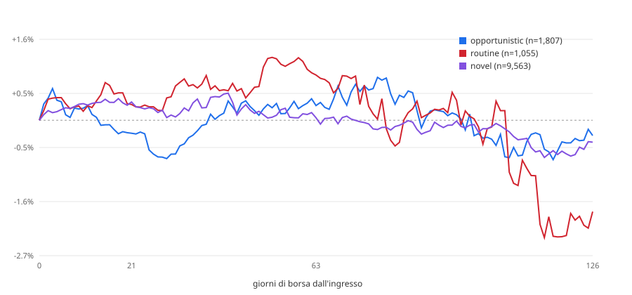

# Backtest event-time — acquisti insider vs Russell 2000 (EUR)

> **Public copy note.** Descriptive report of 2026-09-01, not pre-registered: the starting point of the US
> insider re-test, which ended **INCONCLUSIVE** once size-matched peers and placebos were added. Read it together
> with `backtest/rematch_50_300m/STUDY.md`. Where a dilution gate appears, it is a predicate defined for these
> reports and the re-test, **not a validated filter**.

Generato il 2026-09-01. Rieseguibile con:

```
python tools/backtest_event_time.py --horizons 21,63,126 --benchmark iwm --cost-bps 100 --start 2015-01-01
```

## Popolazione

**Questi non sono segnali.** Lo scanner non ha mai girato sullo storico: l'archivio observations copre tre giorni di run e il suo acquisto piu' vecchio e' di giugno 2026. La popolazione qui e' il corpus — acquisti open-market codice P, non derivati, non 10b5-1 — che non ha passato il cancello diluizione e non ha uno `score_v3`, perche' nessuno dei due esisteva quando quei Form 4 sono stati depositati.

| | |
|---|---:|
| eventi (emittente x data di deposito) | 72,190 |
| di cui misurabili (`OK` o `PARTIAL`) | 51,025 |
| `DELISTED_NO_DATA` | 21,144 |
| `NO_ENTRY_BAR` | 21 |
| `NO_BENCH_BAR` | 0 |
| benchmark | `IWM` |
| costo round trip | 1.00% |

## Aggregato, excess lordo

### (a) tutti gli eventi

| | n | media | mediana | dev.std | hit rate | t | IC 95% |
|---|---:|---:|---:|---:|---:|---:|---:|
| **21 giorni** | 50,801 | +0.13% | -0.69% | +18.21% | 47% | 1.60 | -0.03% – +0.28% |
| **63 giorni** | 50,575 | +0.23% | -1.76% | +31.54% | 45% | 1.66 | -0.03% – +0.47% |
| **126 giorni** | 49,665 | -0.65% | -3.21% | +42.08% | 44% | -3.43 | -1.03% – -0.27% |

### (b) un evento per emittente, cooldown 126gg

| | n | media | mediana | dev.std | hit rate | t | IC 95% |
|---|---:|---:|---:|---:|---:|---:|---:|
| **21 giorni** | 21,201 | +0.29% | -0.64% | +19.34% | 47% | 2.16 | +0.01% – +0.56% |
| **63 giorni** | 21,098 | +0.40% | -1.55% | +32.02% | 46% | 1.82 | -0.01% – +0.83% |
| **126 giorni** | 20,707 | -0.34% | -2.75% | +42.52% | 45% | -1.13 | -0.90% – +0.20% |

## Aggregato, excess netto del costo

| | n | media | mediana | dev.std | hit rate | t | IC 95% |
|---|---:|---:|---:|---:|---:|---:|---:|
| **21 giorni** | 21,201 | -0.71% | -1.64% | +19.34% | 42% | -5.37 | -0.99% – -0.44% |
| **63 giorni** | 21,098 | -0.60% | -2.55% | +32.02% | 43% | -2.72 | -1.01% – -0.17% |
| **126 giorni** | 20,707 | -1.34% | -3.75% | +42.52% | 43% | -4.52 | -1.90% – -0.80% |

_Variante (b). Il costo e' un haircut sulla gamba titolo._

---

## Spaccature a 21 giorni — variante (b)

### Tre classi (mappatura dichiarata, confrontabile con Table III di CMP)

| | n | media | mediana | dev.std | hit rate | t | IC 95% |
|---|---:|---:|---:|---:|---:|---:|---:|
| **OPPORTUNISTIC** | 1,799 | -0.26% | -1.08% | +17.86% | 45% | -0.61 | -1.10% – +0.58% |
| **UNCLASSIFIED** | 18,351 | +0.34% | -0.57% | +19.62% | 47% | 2.34 | +0.06% – +0.62% |
| **ROUTINE** | 1,051 | +0.31% | -0.78% | +16.50% | 46% | 0.62 | -0.58% – +1.30% |

`UNCLASSIFIED` = `novel` + `sparse` + `unseasoned`. Un evento e' `ROUTINE` solo se **tutti** i compratori lo sono.

### Cinque classi native

| | n | media | mediana | dev.std | hit rate | t | IC 95% |
|---|---:|---:|---:|---:|---:|---:|---:|
| **opportunistic** | 1,799 | -0.26% | -1.08% | +17.86% | 45% | -0.61 | -1.10% – +0.58% |
| **novel** | 9,520 | +0.36% | -0.51% | +20.05% | 47% | 1.77 | -0.04% – +0.78% |
| **sparse** | 8,831 | +0.31% | -0.66% | +19.15% | 47% | 1.54 | -0.07% – +0.75% |
| **routine** | 1,051 | +0.31% | -0.78% | +16.50% | 46% | 0.62 | -0.58% – +1.30% |

### Numero di compratori distinti

| | n | media | mediana | dev.std | hit rate | t | IC 95% |
|---|---:|---:|---:|---:|---:|---:|---:|
| **1 compratore** | 16,436 | +0.12% | -0.62% | +17.67% | 47% | 0.84 | -0.14% – +0.39% |
| **2 compratori** | 2,226 | +0.83% | -0.53% | +25.03% | 48% | 1.57 | -0.16% – +1.85% |
| **3 o piu'** | 2,539 | +0.92% | -0.80% | +23.46% | 47% | 1.98 | +0.07% – +1.90% |

### Anno di deposito

| | n | media | mediana | dev.std | hit rate | t | IC 95% |
|---|---:|---:|---:|---:|---:|---:|---:|
| **2015** | 1,865 | +0.40% | +0.07% | +16.82% | 50% | 1.02 | -0.31% – +1.20% |
| **2016** | 1,574 | +0.60% | -0.79% | +20.26% | 46% | 1.18 | -0.32% – +1.72% |
| **2017** | 1,515 | +0.70% | -0.46% | +18.61% | 47% | 1.46 | -0.20% – +1.73% |
| **2018** | 1,835 | +0.67% | -0.23% | +16.91% | 49% | 1.69 | -0.16% – +1.48% |
| **2019** | 1,646 | +1.18% | -0.06% | +19.21% | 49% | 2.48 | +0.29% – +2.17% |
| **2020** | 2,074 | -0.45% | -2.20% | +22.68% | 42% | -0.90 | -1.39% – +0.56% |
| **2021** | 1,908 | +0.47% | +0.04% | +16.79% | 50% | 1.21 | -0.28% – +1.21% |
| **2022** | 2,200 | +0.20% | -0.16% | +19.23% | 49% | 0.50 | -0.60% – +1.00% |
| **2023** | 1,991 | -0.04% | -0.73% | +18.84% | 47% | -0.09 | -0.83% – +0.74% |
| **2024** | 1,865 | -0.21% | -0.85% | +19.39% | 46% | -0.47 | -1.10% – +0.67% |
| **2025** | 2,163 | +0.53% | -1.50% | +22.73% | 43% | 1.08 | -0.35% – +1.58% |
| **2026** | 565 | -1.62% | -1.74% | +16.34% | 43% | -2.35 | -2.88% – -0.24% |

---

## Spaccature a 63 giorni — variante (b)

### Tre classi (mappatura dichiarata, confrontabile con Table III di CMP)

| | n | media | mediana | dev.std | hit rate | t | IC 95% |
|---|---:|---:|---:|---:|---:|---:|---:|
| **OPPORTUNISTIC** | 1,793 | +0.29% | -1.73% | +32.32% | 45% | 0.38 | -1.27% – +1.82% |
| **UNCLASSIFIED** | 18,255 | +0.38% | -1.58% | +32.02% | 46% | 1.62 | -0.07% – +0.84% |
| **ROUTINE** | 1,050 | +0.90% | -1.18% | +31.49% | 47% | 0.92 | -0.91% – +2.76% |

`UNCLASSIFIED` = `novel` + `sparse` + `unseasoned`. Un evento e' `ROUTINE` solo se **tutti** i compratori lo sono.

### Cinque classi native

| | n | media | mediana | dev.std | hit rate | t | IC 95% |
|---|---:|---:|---:|---:|---:|---:|---:|
| **opportunistic** | 1,793 | +0.29% | -1.73% | +32.32% | 45% | 0.38 | -1.27% – +1.82% |
| **novel** | 9,469 | +0.05% | -1.53% | +32.34% | 46% | 0.15 | -0.62% – +0.75% |
| **sparse** | 8,786 | +0.74% | -1.62% | +31.68% | 46% | 2.19 | +0.06% – +1.39% |
| **routine** | 1,050 | +0.90% | -1.18% | +31.49% | 47% | 0.92 | -0.91% – +2.76% |

### Numero di compratori distinti

| | n | media | mediana | dev.std | hit rate | t | IC 95% |
|---|---:|---:|---:|---:|---:|---:|---:|
| **1 compratore** | 16,370 | +0.57% | -1.22% | +31.32% | 47% | 2.34 | +0.10% – +1.06% |
| **2 compratori** | 2,207 | -0.56% | -2.74% | +34.38% | 43% | -0.76 | -1.99% – +1.02% |
| **3 o piu'** | 2,521 | +0.12% | -3.12% | +34.28% | 44% | 0.18 | -1.23% – +1.51% |

### Anno di deposito

| | n | media | mediana | dev.std | hit rate | t | IC 95% |
|---|---:|---:|---:|---:|---:|---:|---:|
| **2015** | 1,849 | +0.45% | +0.17% | +23.44% | 51% | 0.83 | -0.61% – +1.55% |
| **2016** | 1,565 | +0.67% | -1.48% | +30.02% | 45% | 0.88 | -0.85% – +2.17% |
| **2017** | 1,504 | +1.72% | -0.24% | +28.80% | 49% | 2.32 | +0.20% – +3.16% |
| **2018** | 1,820 | +2.03% | +0.26% | +28.21% | 51% | 3.07 | +0.83% – +3.28% |
| **2019** | 1,639 | +0.60% | -0.60% | +28.81% | 48% | 0.85 | -0.80% – +2.13% |
| **2020** | 2,065 | +2.81% | -4.87% | +42.48% | 41% | 3.00 | +1.05% – +4.67% |
| **2021** | 1,897 | -0.52% | -0.01% | +29.16% | 50% | -0.77 | -1.71% – +0.76% |
| **2022** | 2,190 | -1.33% | -1.42% | +27.88% | 46% | -2.23 | -2.53% – -0.19% |
| **2023** | 1,987 | -0.20% | -1.91% | +34.89% | 45% | -0.26 | -1.69% – +1.40% |
| **2024** | 1,859 | +1.14% | -0.90% | +35.17% | 48% | 1.39 | -0.71% – +2.73% |
| **2025** | 2,159 | -0.36% | -3.87% | +35.67% | 40% | -0.47 | -1.89% – +1.20% |
| **2026** | 564 | -6.27% | -9.22% | +32.52% | 29% | -4.58 | -8.83% – -3.37% |

---

## Spaccature a 126 giorni — variante (b)

### Tre classi (mappatura dichiarata, confrontabile con Table III di CMP)

| | n | media | mediana | dev.std | hit rate | t | IC 95% |
|---|---:|---:|---:|---:|---:|---:|---:|
| **OPPORTUNISTIC** | 1,758 | -0.30% | -2.46% | +41.73% | 44% | -0.31 | -2.22% – +1.64% |
| **UNCLASSIFIED** | 17,922 | -0.25% | -2.75% | +42.66% | 45% | -0.80 | -0.86% – +0.42% |
| **ROUTINE** | 1,027 | -1.81% | -3.25% | +41.48% | 43% | -1.40 | -4.12% – +0.84% |

`UNCLASSIFIED` = `novel` + `sparse` + `unseasoned`. Un evento e' `ROUTINE` solo se **tutti** i compratori lo sono.

### Cinque classi native

| | n | media | mediana | dev.std | hit rate | t | IC 95% |
|---|---:|---:|---:|---:|---:|---:|---:|
| **opportunistic** | 1,758 | -0.30% | -2.46% | +41.73% | 44% | -0.31 | -2.22% – +1.64% |
| **novel** | 9,317 | -0.43% | -2.31% | +41.95% | 46% | -1.00 | -1.34% – +0.44% |
| **sparse** | 8,605 | -0.06% | -3.14% | +43.41% | 44% | -0.12 | -0.96% – +0.83% |
| **routine** | 1,027 | -1.81% | -3.25% | +41.48% | 43% | -1.40 | -4.12% – +0.84% |

### Numero di compratori distinti

| | n | media | mediana | dev.std | hit rate | t | IC 95% |
|---|---:|---:|---:|---:|---:|---:|---:|
| **1 compratore** | 16,062 | +0.00% | -2.15% | +40.92% | 46% | 0.01 | -0.62% – +0.60% |
| **2 compratori** | 2,169 | -1.64% | -4.79% | +45.74% | 42% | -1.67 | -3.42% – +0.31% |
| **3 o piu'** | 2,476 | -1.39% | -5.79% | +49.22% | 42% | -1.41 | -3.49% – +0.44% |

### Anno di deposito

| | n | media | mediana | dev.std | hit rate | t | IC 95% |
|---|---:|---:|---:|---:|---:|---:|---:|
| **2015** | 1,836 | +0.58% | +1.49% | +32.19% | 53% | 0.77 | -0.87% – +2.11% |
| **2016** | 1,557 | -0.06% | -2.83% | +38.82% | 46% | -0.06 | -1.93% – +1.83% |
| **2017** | 1,490 | +1.00% | -2.32% | +36.01% | 44% | 1.07 | -0.68% – +2.78% |
| **2018** | 1,802 | +1.64% | -0.16% | +31.74% | 49% | 2.20 | +0.25% – +3.12% |
| **2019** | 1,632 | +1.77% | -1.52% | +42.06% | 47% | 1.70 | -0.23% – +3.76% |
| **2020** | 2,054 | +1.80% | -9.00% | +57.09% | 39% | 1.43 | -0.67% – +4.27% |
| **2021** | 1,894 | -2.19% | +0.09% | +36.64% | 50% | -2.60 | -3.88% – -0.55% |
| **2022** | 2,186 | -2.03% | -3.12% | +38.34% | 45% | -2.47 | -3.65% – -0.64% |
| **2023** | 1,981 | -2.11% | -3.96% | +41.12% | 43% | -2.28 | -3.85% – -0.24% |
| **2024** | 1,857 | +1.76% | -1.18% | +49.57% | 48% | 1.53 | -0.36% – +4.12% |
| **2025** | 2,158 | -3.93% | -10.17% | +50.79% | 35% | -3.59 | -6.06% – -1.68% |
| **2026** | 260 | -3.74% | -7.73% | +46.32% | 35% | -1.30 | -9.21% – +1.73% |

---

## Curva event-time

Excess medio cumulato giorno per giorno da 0 a 126, variante (b). E' il confronto diretto con la Figura 3 di CMP.



Dati: `backtest-event-time-curve-2026-09-01.csv`, 127 punti.

| classe | giorno 21 | giorno 63 | giorno 126 | n al giorno 0 |
|---|---:|---:|---:|---:|
| novel | +0.36% | +0.05% | -0.43% | 9,563 |
| opportunistic | -0.26% | +0.29% | -0.30% | 1,807 |
| routine | +0.31% | +0.90% | -1.81% | 1,055 |
| sparse | +0.31% | +0.74% | -0.06% | 8,886 |

---

## Quanto vale il 29.3% senza prezzi

Gli eventi senza serie prezzi non sono un campione neutro: sono i falliti e i delistati. Il panel storico pero' un excess a 6 mesi ce l'ha, calcolato ai tempi **contro il fattore di mercato Fama-French** — un altro benchmark, quindi il confronto dice la direzione e l'ordine di grandezza, non il centesimo.

| | n | media | mediana | dev.std | hit rate | t | IC 95% |
|---|---:|---:|---:|---:|---:|---:|---:|
| **senza serie prezzi** | 4,793 | -2.47% | -4.38% | +38.87% | 42% | -4.40 | -3.53% – -1.40% |
| **con serie prezzi** | 170,413 | +0.89% | -2.11% | +42.23% | 46% | 8.73 | +0.71% – +1.08% |

Scarto fra le due medie: **-3.36%**. Gli esclusi sono andati **peggio**: ogni numero di questo documento e' sovrastimato di un ordine simile.

---

## Limiti

1. **Survivorship.** 21,144 eventi su 72,190 non hanno serie prezzi (29.3%). Non e' rumore: e' la parte del campione che e' fallita. La sezione qui sopra la quantifica.
2. **Periodo coperto:** depositi dal 2015-01-01 in poi; il corpus arriva al 2026Q1. Gli eventi troppo recenti per chiudere un orizzonte sono `PARTIAL` e non entrano negli aggregati.
3. **Costo assunto:** 1.00% round trip, come haircut sulla gamba titolo. Non include lo spread denaro-lettera delle nano-cap, che su questo universo e' la voce piu' grande.
4. **Eventi sovrapposti.** La variante (a) conta lo stesso emittente decine di volte dentro la stessa finestra di 126 giorni e la sua t-stat e' gonfiata. La (b) e' quella da leggere.
5. **`unseasoned` non compare**: distinguerlo da `novel` richiede la prima data di deposito del CIK, che il corpus non porta.
6. **Barre oltre il ±500% scartate** (`ARTEFACT = 5.0`), stessa regola del resto del repo.
7. **Benchmark UCITS:** con `--benchmark xrs2` mancano le prime nove settimane del 2015, e TER piu' tracking error gonfiano leggermente l'excess a favore della strategia.

### Incoerenze trovate nei dati, non corrette

- `total_buy_usd = 305.496.908.725` su una riga del panel: 305 miliardi su un singolo cluster, quasi certamente azioni x prezzo su un campo sbagliato.
- Una `transaction_date` del **2006-08-28** dentro le observations di agosto 2026: deposito tardivo o amendment.

Nessuna delle due e' stata corretta: non e' il compito di questo backtest.
